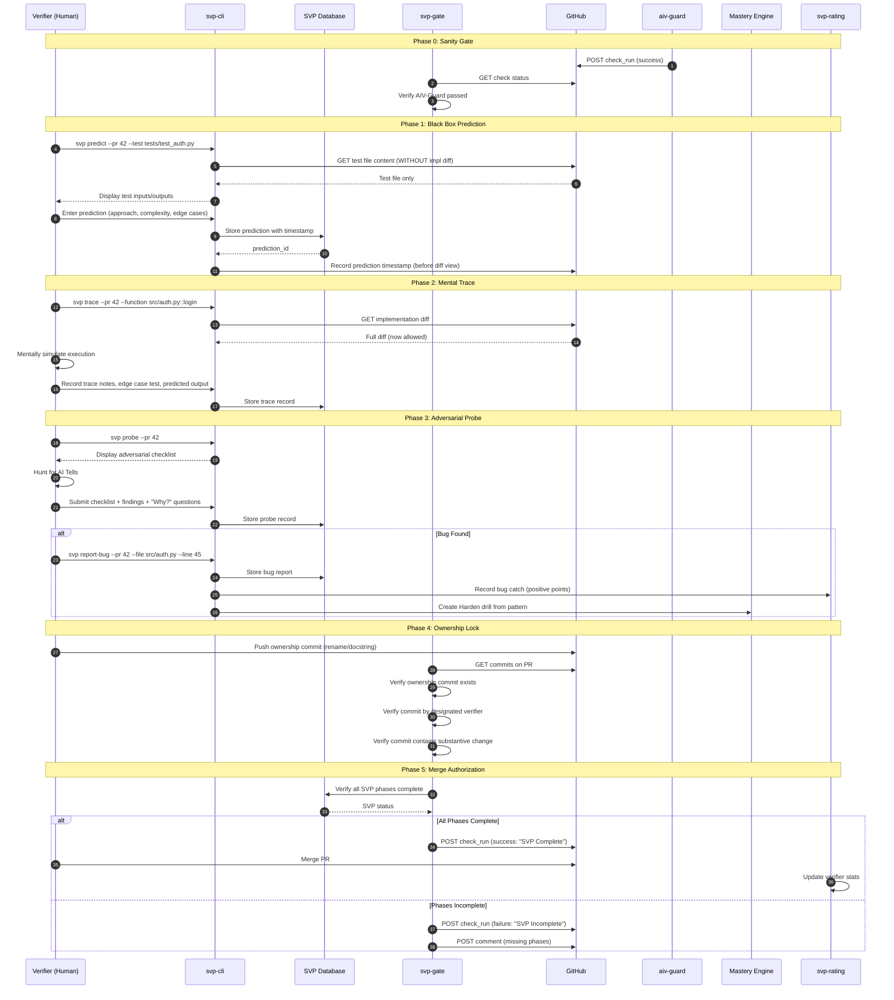

# SVP Protocol Suite: Definitive Technical Specification

**Document ID:** SVP-SUITE-SPEC-V1.0-CANONICAL
**Version:** 1.0.0
**Status:** Canonical Reference Implementation
**Date:** 2025-12-20
**Companion Document:** AIV-SUITE-SPEC-V1.0-CANONICAL
**Purpose:** To provide the complete, authoritative technical specification for enforcing, tracking, and measuring the Systematic Verifier Protocol (SVP), ensuring that cognitive energy saved by automation is verifiably reinvested into deep architectural mastery.

---

## Table of Contents

1. [Executive Summary](#1-executive-summary)
2. [Foundational Protocol Reference](#2-foundational-protocol-reference)
3. [System Architecture](#3-system-architecture)
4. [Data Models](#4-data-models)
5. [Core Algorithms](#5-core-algorithms)
6. [Component Specifications](#6-component-specifications)
7. [SVP Execution Engine](#7-svp-execution-engine)
8. [Ownership Lock Enforcement](#8-ownership-lock-enforcement)
9. [Verifier Rating System](#9-verifier-rating-system)
10. [Mastery Engine Integration](#10-mastery-engine-integration)
11. [Failure Routing Protocol](#11-failure-routing-protocol)
12. [Testing Strategy](#12-testing-strategy)
13. [Deployment & Integration](#13-deployment--integration)
14. [Appendices](#14-appendices)

---

## 1. Executive Summary

### 1.1 Problem Statement

The AIV Protocol Suite (AIV-SUITE-SPEC-V1.0-CANONICAL) successfully eliminates **logistic load** through automated evidence validation and the Zero-Touch mandate. However, it creates an **unfunded mandate**: the cognitive surplus generated is expected to be reinvested into deep architectural understanding, but no mechanism exists to verify, track, or enforce this reinvestment.

This creates three critical failure modes:

1. **Cognitive Atrophy:** Verifiers skim code, approve green CI badges, and never build mental models of the system.
2. **Skill Stagnation:** Without measurement, verification skill cannot be tracked, improved, or rewarded.
3. **Mastery Illusion:** The organization believes it has skilled verifiers because PRs get approved, but no actual knowledge transfer occurs.

### 1.2 Solution Overview

The **SVP Protocol Suite** is the enforcement, tracking, and measurement layer for the human cognitive process. It transforms the SVP from a set of recommendations into an auditable, measurable discipline.

| Component   | Role                                                  | Deployment      |
| ----------- | ----------------------------------------------------- | --------------- |
| svp-lib     | Core cognitive tracking models and validators         | Python library  |
| svp-cli     | Verifier tooling for prediction, trace, and ownership | CLI application |
| svp-gate    | Merge-blocking enforcement of SVP completion          | GitHub Action   |
| svp-rating  | ELO-style verifier skill measurement                  | API service     |
| svp-mastery | Integration with Mastery Engine for skill development | API bridge      |

### 1.3 Design Principles

These principles are non-negotiable constraints on all implementation decisions:

1. **Cognitive Work Must Be Proven:** Every SVP phase must produce a verifiable artifact. "I thought about it" is not evidence.

2. **Ownership Is Non-Negotiable:** The verifier must push at least one commit to any PR they approve. This is the cryptographic signature of cognitive engagement.

3. **Skill Must Be Measured:** Verification quality is quantified through an ELO-style rating system based on bugs caught, bugs missed, and false positives.

4. **Failure Fuels Growth:** Every bug that escapes verification becomes a training drill in the Mastery Engine.

5. **The SVP Is Not Optional:** A PR cannot merge without documented proof of SVP execution.

### 1.4 Relationship to AIV Suite

```
┌─────────────────────────────────────────────────────────────────────────────┐
│                        Complete Verification Stack                           │
├─────────────────────────────────────────────────────────────────────────────┤
│                                                                              │
│  ┌─────────────────────────────────────────────────────────────────────────┐│
│  │                    SVP Protocol Suite (This Document)                   ││
│  │                                                                          ││
│  │  Phase 3: Human Cognitive Verification                                   ││
│  │  • Black Box Prediction                                                  ││
│  │  • Mental Trace                                                          ││
│  │  • Adversarial Probe                                                     ││
│  │  • Ownership Lock                                                        ││
│  │  • Skill Measurement                                                     ││
│  │  • Mastery Integration                                                   ││
│  └─────────────────────────────────────────────────────────────────────────┘│
│                                     ▲                                        │
│                                     │ Requires                               │
│                                     │                                        │
│  ┌─────────────────────────────────────────────────────────────────────────┐│
│  │                    AIV Protocol Suite (Companion Doc)                    ││
│  │                                                                          ││
│  │  Phase 1-2: Automated Evidence Validation                                ││
│  │  • Verification Packet Parsing                                           ││
│  │  • Evidence Class Validation (A-F)                                       ││
│  │  • Zero-Touch Enforcement                                                ││
│  │  • Anti-Cheat Scanning                                                   ││
│  │  • Link Immutability                                                     ││
│  └─────────────────────────────────────────────────────────────────────────┘│
│                                                                              │
└─────────────────────────────────────────────────────────────────────────────┘
```

**Dependency:** The SVP Suite requires aiv-guard to pass before SVP execution begins. A PR with invalid evidence cannot enter SVP review.

### 1.5 Success Criteria

| Metric                   | Target                                            | Measurement Method             |
| ------------------------ | ------------------------------------------------- | ------------------------------ |
| SVP Completion Rate      | 100% of merged PRs have SVP artifacts             | Audit log analysis             |
| Ownership Commit Rate    | 100% of merged PRs have verifier commit           | Git history analysis           |
| Prediction Accuracy      | >70% of predictions match implementation approach | Prediction vs. impl comparison |
| Skill Improvement        | Positive ELO trend over 90-day rolling window     | Rating system analytics        |
| Bug Escape Rate          | <5% of production bugs were in verified PRs       | Incident post-mortem analysis  |
| Mastery Drill Completion | 100% of escaped bugs become drills                | Mastery Engine integration     |

---

## 2. Foundational Protocol Reference

This section extracts the SVP requirements into machine-parseable, enforceable specifications.

### 2.1 SVP Phase Taxonomy

The SVP consists of five mandatory phases, each producing verifiable artifacts:

```yaml
svp_phases:
  phase_0:
    name: "Sanity Gate"
    description: "Verify AIV-Guard has passed"
    prerequisite: true
    automated: true
    artifacts:
      - aiv_guard_status: "passing"
    validation:
      - rule: "AIV-Guard check must be GREEN"
        blocker: true

  phase_1:
    name: "Black Box Prediction"
    description: "Predict implementation approach before viewing code"
    cognitive_mode: "Strategic / System 2"
    skill_trained: "Architectural-Alignment"
    artifacts:
      - prediction_record:
          test_file_path: string
          predicted_approach: text
          predicted_complexity: enum[O(1), O(log n), O(n), O(n log n), O(n²), O(2^n)]
          expected_edge_cases: list[string]
          timestamp: datetime
          verifier_id: string
    validation:
      - rule: "Prediction must be recorded BEFORE implementation diff is viewed"
        blocker: true
      - rule: "Prediction must contain at least 50 characters"
        blocker: false
      - rule: "At least 2 edge cases must be predicted"
        blocker: false

  phase_2:
    name: "Mental Trace"
    description: "Simulate execution flow without running code"
    cognitive_mode: "High Intensity / System 2"
    skill_trained: "Trace-Accuracy"
    artifacts:
      - trace_record:
          function_path: string
          trace_notes: text
          state_transitions: list[string]
          edge_case_tested: string
          predicted_output: string
          confidence: enum[high, medium, low]
          timestamp: datetime
    validation:
      - rule: "At least one trace record required per PR"
        blocker: true
      - rule: "Trace notes must contain at least 100 characters"
        blocker: false
      - rule: "Edge case test must be documented"
        blocker: true

  phase_3:
    name: "Adversarial Probe"
    description: "Hunt for AI Tells and subtle hallucinations"
    cognitive_mode: "Adversarial / System 2"
    skill_trained: "Fault-Localization"
    artifacts:
      - probe_record:
          checklist_completed: boolean
          happy_path_bias_checked: boolean
          context_amnesia_checked: boolean
          fragile_assertions_checked: boolean
          why_questions_asked: list[string]
          findings: list[finding]
          timestamp: datetime
    validation:
      - rule: "Checklist must be submitted"
        blocker: true
      - rule: "At least one 'Why?' question must be documented"
        blocker: false

  phase_4:
    name: "Ownership Lock"
    description: "Transform alien code into native knowledge"
    cognitive_mode: "Synthesis / System 2"
    skill_trained: "Semantic-Integration"
    artifacts:
      - ownership_commit:
          commit_sha: string
          author: string
          contains_rename: boolean
          contains_docstring: boolean
          message_pattern: "ownership: *"
    validation:
      - rule: "Ownership commit must exist"
        blocker: true
      - rule: "Ownership commit must be by designated verifier"
        blocker: true
      - rule: "Commit must contain rename OR docstring change"
        blocker: true
```

### 2.2 Cognitive Artifact Requirements

Each SVP phase produces artifacts that serve as **proof of cognitive work**:

```yaml
artifact_requirements:
  prediction_record:
    purpose: "Proves verifier formed mental model before seeing implementation"
    anti_gaming_measures:
      - timestamp_must_precede_first_diff_view
      - minimum_content_length: 50
      - must_contain_complexity_estimate
    storage: svp_database
    retention: permanent

  trace_record:
    purpose: "Proves verifier simulated execution mentally"
    anti_gaming_measures:
      - must_reference_specific_function_path
      - must_include_state_transition_description
      - must_test_at_least_one_edge_case
    storage: svp_database
    retention: permanent

  probe_record:
    purpose: "Proves verifier actively hunted for flaws"
    anti_gaming_measures:
      - checklist_items_must_be_individually_confirmed
      - at_least_one_why_question_required
      - findings_cross_referenced_with_diff
    storage: svp_database
    retention: permanent

  ownership_commit:
    purpose: "Proves verifier took semantic ownership of code"
    anti_gaming_measures:
      - commit_must_be_on_pr_branch
      - commit_must_modify_files_in_pr_diff
      - trivial_changes_detected_and_flagged
    storage: git_history
    retention: permanent
```

### 2.3 Validation Rules Matrix

| Rule ID | Phase | Description                                      | Severity | Auto-Fixable |
| ------- | ----- | ------------------------------------------------ | -------- | ------------ |
| S001    | 0     | AIV-Guard must pass before SVP begins            | BLOCK    | No           |
| S002    | 1     | Prediction must be recorded                      | BLOCK    | No           |
| S003    | 1     | Prediction timestamp must precede diff view      | BLOCK    | No           |
| S004    | 1     | Prediction must contain complexity estimate      | WARN     | No           |
| S005    | 2     | At least one trace record required               | BLOCK    | No           |
| S006    | 2     | Trace must include edge case test                | BLOCK    | No           |
| S007    | 2     | Trace notes must meet minimum length             | WARN     | No           |
| S008    | 3     | Adversarial checklist must be submitted          | BLOCK    | No           |
| S009    | 3     | At least one "Why?" question documented          | WARN     | No           |
| S010    | 4     | Ownership commit must exist                      | BLOCK    | No           |
| S011    | 4     | Ownership commit must be by verifier             | BLOCK    | No           |
| S012    | 4     | Ownership commit must contain substantive change | BLOCK    | No           |
| S013    | 4     | Ownership commit message must match pattern      | WARN     | No           |

---

## 3. System Architecture

### 3.1 High-Level Architecture

```
┌─────────────────────────────────────────────────────────────────────────────┐
│                           SVP Protocol Suite                                 │
├─────────────────────────────────────────────────────────────────────────────┤
│                                                                              │
│  ┌──────────────┐    ┌──────────────┐    ┌──────────────┐    ┌────────────┐│
│  │   svp-cli    │    │   svp-gate   │    │  svp-rating  │    │  svp-lib   ││
│  │              │    │              │    │              │    │            ││
│  │ • predict    │    │ • GitHub     │    │ • ELO Calc   │    │ • Models   ││
│  │ • trace      │    │   Action     │    │ • Leaderboard│    │ • Validators│
│  │ • probe      │    │ • Merge      │    │ • Tier Mgmt  │    │ • Storage  ││
│  │ • ownership  │    │   Blocking   │    │              │    │            ││
│  └──────┬───────┘    └──────┬───────┘    └──────┬───────┘    └─────┬──────┘│
│         │                   │                   │                   │       │
│         └───────────────────┴───────────────────┴───────────────────┘       │
│                                     │                                        │
│                            ┌────────┴────────┐                              │
│                            │   SVP Database   │                              │
│                            │                 │                              │
│                            │ • Predictions   │                              │
│                            │ • Traces        │                              │
│                            │ • Probes        │                              │
│                            │ • Ratings       │                              │
│                            │ • Bug Reports   │                              │
│                            └─────────────────┘                              │
│                                                                              │
├─────────────────────────────────────────────────────────────────────────────┤
│                              Integrations                                    │
├─────────────────────────────────────────────────────────────────────────────┤
│  ┌──────────────┐    ┌──────────────┐    ┌──────────────┐                   │
│  │  AIV Suite   │    │   Mastery    │    │   GitHub     │                   │
│  │  (Companion) │    │   Engine     │    │   API        │                   │
│  │              │    │              │    │              │                   │
│  │ • aiv-guard  │    │ • Harden     │    │ • Commits    │                   │
│  │ • Packet     │    │ • Drills     │    │ • PRs        │                   │
│  │   Validation │    │ • Curricula  │    │ • Reviews    │                   │
│  └──────────────┘    └──────────────┘    └──────────────┘                   │
└─────────────────────────────────────────────────────────────────────────────┘
```

### 3.2 SVP Execution Flow



### 3.3 Repository Structure

```
svp-protocol/
├── .github/
│   ├── workflows/
│   │   ├── ci.yml                    # Self-testing pipeline
│   │   ├── release.yml               # Semantic versioning
│   │   └── gate.yml                  # Reusable SVP gate workflow
│   └── ISSUE_TEMPLATE/
│       ├── bug_report.yml            # Report escaped bug
│       └── false_positive.yml        # Report incorrect SVP failure
│
├── src/
│   └── svp/
│       ├── __init__.py
│       ├── py.typed                  # PEP 561 marker
│       │
│       ├── lib/                      # Core library (svp-lib)
│       │   ├── __init__.py
│       │   ├── models.py             # Pydantic data models
│       │   ├── storage.py            # Database abstraction
│       │   ├── validators/
│       │   │   ├── __init__.py
│       │   │   ├── prediction.py     # Phase 1 validation
│       │   │   ├── trace.py          # Phase 2 validation
│       │   │   ├── probe.py          # Phase 3 validation
│       │   │   └── ownership.py      # Phase 4 validation
│       │   ├── rating/
│       │   │   ├── __init__.py
│       │   │   ├── elo.py            # ELO calculation
│       │   │   ├── tiers.py          # Tier management
│       │   │   └── leaderboard.py    # Rankings
│       │   └── mastery/
│       │       ├── __init__.py
│       │       ├── drill_generator.py # Convert bugs to drills
│       │       └── api_client.py     # Mastery Engine API
│       │
│       ├── cli/                      # CLI application (svp-cli)
│       │   ├── __init__.py
│       │   ├── main.py               # Typer application
│       │   ├── commands/
│       │   │   ├── __init__.py
│       │   │   ├── predict.py        # Phase 1 command
│       │   │   ├── trace.py          # Phase 2 command
│       │   │   ├── probe.py          # Phase 3 command
│       │   │   ├── ownership.py      # Phase 4 helper
│       │   │   ├── status.py         # View SVP completion
│       │   │   ├── report_bug.py     # Report discovered bug
│       │   │   └── rating.py         # View personal rating
│       │   └── ui/
│       │       ├── __init__.py
│       │       ├── prediction_form.py
│       │       ├── trace_worksheet.py
│       │       └── probe_checklist.py
│       │
│       └── gate/                     # GitHub Action (svp-gate)
│           ├── __init__.py
│           ├── action.py             # Main entry point
│           ├── github_client.py      # Safe GitHub API wrapper
│           ├── validators.py         # SVP completion checks
│           └── reporters.py          # Comment formatting
│
├── tests/
│   ├── conftest.py                   # Shared fixtures
│   ├── unit/
│   │   ├── test_models.py
│   │   ├── test_validators/
│   │   ├── test_rating/
│   │   └── test_mastery/
│   ├── integration/
│   │   ├── test_cli.py
│   │   ├── test_gate.py
│   │   └── test_full_workflow.py
│   └── fixtures/
│       ├── predictions/              # Sample predictions
│       ├── traces/                   # Sample trace records
│       └── ownership_commits/        # Sample commits
│
├── migrations/                       # Database migrations
│   ├── 001_initial.sql
│   └── 002_add_ratings.sql
│
├── docs/
│   ├── protocol/                     # SVP reference
│   ├── integration/                  # Setup guides
│   └── api/                          # Generated API docs
│
├── pyproject.toml
├── README.md
├── LICENSE                           # MIT
└── CHANGELOG.md
```

---

## 4. Data Models

All data models use Pydantic v2 for validation, serialization, and documentation.

### 4.1 Core SVP Models

```python
"""
svp/lib/models.py

Core data models for the SVP Protocol Suite.
"""

from __future__ import annotations

from datetime import datetime
from enum import Enum
from typing import Annotated, Literal
from uuid import UUID, uuid4

from pydantic import (
    BaseModel,
    ConfigDict,
    Field,
    field_validator,
    model_validator,
)


# =============================================================================
# Enums
# =============================================================================

class Complexity(str, Enum):
    """Big-O complexity estimates for predictions."""
    CONSTANT = "O(1)"
    LOGARITHMIC = "O(log n)"
    LINEAR = "O(n)"
    LINEARITHMIC = "O(n log n)"
    QUADRATIC = "O(n²)"
    EXPONENTIAL = "O(2^n)"
    UNKNOWN = "Unknown"


class Confidence(str, Enum):
    """Confidence level for trace predictions."""
    HIGH = "high"
    MEDIUM = "medium"
    LOW = "low"


class SVPPhase(str, Enum):
    """The five phases of SVP execution."""
    SANITY = "phase_0_sanity"
    PREDICTION = "phase_1_prediction"
    TRACE = "phase_2_trace"
    PROBE = "phase_3_probe"
    OWNERSHIP = "phase_4_ownership"


class SVPStatus(str, Enum):
    """Overall SVP completion status."""
    NOT_STARTED = "not_started"
    IN_PROGRESS = "in_progress"
    COMPLETE = "complete"
    BLOCKED = "blocked"


class BugSeverity(str, Enum):
    """Severity of discovered bugs."""
    CRITICAL = "critical"
    HIGH = "high"
    MEDIUM = "medium"
    LOW = "low"


class VerifierTier(str, Enum):
    """Verifier skill tiers based on ELO rating."""
    NOVICE = "novice"           # 0-500
    COMPETENT = "competent"     # 500-1000
    PROFICIENT = "proficient"   # 1000-1500
    EXPERT = "expert"           # 1500-2000
    MASTER = "master"           # 2000+


# =============================================================================
# Phase 1: Prediction Models
# =============================================================================

class PredictionRecord(BaseModel):
    """
    Record of a Black Box Prediction (Phase 1).

    The verifier must record their prediction of how the implementation
    works BEFORE viewing the implementation diff. This proves they
    formed an independent mental model.
    """
    model_config = ConfigDict(frozen=True)

    id: UUID = Field(default_factory=uuid4)
    pr_number: int = Field(ge=1)
    repository: str = Field(pattern=r"^[\w-]+/[\w-]+$")
    verifier_id: str = Field(min_length=1)

    # The test file that was analyzed
    test_file_path: str = Field(min_length=1)

    # The prediction content
    predicted_approach: str = Field(
        min_length=50,
        description="How the verifier expects the implementation to work"
    )
    predicted_complexity: Complexity
    expected_edge_cases: list[str] = Field(
        min_length=2,
        description="Edge cases the verifier expects to be handled"
    )
    expected_data_structures: list[str] = Field(
        default_factory=list,
        description="Data structures expected in implementation"
    )

    # Timing (critical for anti-gaming)
    created_at: datetime = Field(default_factory=datetime.utcnow)
    diff_first_viewed_at: datetime | None = Field(
        default=None,
        description="When the verifier first viewed the implementation diff"
    )

    @property
    def is_valid_timing(self) -> bool:
        """Check if prediction was made before viewing diff."""
        if self.diff_first_viewed_at is None:
            return True  # Diff not yet viewed
        return self.created_at < self.diff_first_viewed_at


class PredictionComparison(BaseModel):
    """
    Comparison of prediction against actual implementation.

    Used to calculate prediction accuracy for rating adjustments.
    """
    model_config = ConfigDict(frozen=True)

    prediction_id: UUID

    # Accuracy metrics
    approach_match: Literal["exact", "similar", "different"]
    complexity_match: bool
    edge_cases_predicted: int
    edge_cases_in_impl: int
    edge_cases_matched: int

    # Calculated score (0-100)
    accuracy_score: int = Field(ge=0, le=100)

    @classmethod
    def calculate(
        cls,
        prediction: PredictionRecord,
        actual_complexity: Complexity,
        actual_edge_cases: list[str],
        approach_assessment: Literal["exact", "similar", "different"],
    ) -> PredictionComparison:
        """Calculate prediction accuracy."""
        matched = len(set(prediction.expected_edge_cases) & set(actual_edge_cases))

        # Scoring formula
        score = 0
        if approach_assessment == "exact":
            score += 50
        elif approach_assessment == "similar":
            score += 30

        if prediction.predicted_complexity == actual_complexity:
            score += 25

        if len(prediction.expected_edge_cases) > 0:
            edge_score = (matched / len(prediction.expected_edge_cases)) * 25
            score += int(edge_score)

        return cls(
            prediction_id=prediction.id,
            approach_match=approach_assessment,
            complexity_match=prediction.predicted_complexity == actual_complexity,
            edge_cases_predicted=len(prediction.expected_edge_cases),
            edge_cases_in_impl=len(actual_edge_cases),
            edge_cases_matched=matched,
            accuracy_score=min(100, score),
        )


# =============================================================================
# Phase 2: Trace Models
# =============================================================================

class StateTransition(BaseModel):
    """A single state transition during mental trace."""
    model_config = ConfigDict(frozen=True)

    step_number: int = Field(ge=1)
    variable_name: str
    before_value: str
    after_value: str
    line_number: int | None = None


class TraceRecord(BaseModel):
    """
    Record of a Mental Trace (Phase 2).

    The verifier mentally simulates execution of a function
    without running it, recording their predictions.
    """
    model_config = ConfigDict(frozen=True)

    id: UUID = Field(default_factory=uuid4)
    pr_number: int = Field(ge=1)
    repository: str = Field(pattern=r"^[\w-]+/[\w-]+$")
    verifier_id: str = Field(min_length=1)

    # The function being traced
    function_path: str = Field(
        min_length=1,
        description="Path to function, e.g., 'src/auth.py::login'"
    )

    # Trace content
    trace_notes: str = Field(
        min_length=100,
        description="Detailed notes from mental execution"
    )
    state_transitions: list[StateTransition] = Field(
        default_factory=list,
        description="Key state changes during execution"
    )

    # Edge case testing
    edge_case_tested: str = Field(
        min_length=10,
        description="The edge case input used for trace"
    )
    predicted_output: str = Field(
        min_length=1,
        description="Expected output for edge case"
    )

    # Confidence
    confidence: Confidence
    uncertainty_notes: str | None = Field(
        default=None,
        description="What aspects the verifier is uncertain about"
    )

    created_at: datetime = Field(default_factory=datetime.utcnow)


# =============================================================================
# Phase 3: Probe Models
# =============================================================================

class AITellType(str, Enum):
    """Types of AI Tells to hunt for."""
    HAPPY_PATH_BIAS = "happy_path_bias"
    CONTEXT_AMNESIA = "context_amnesia"
    FRAGILE_ASSERTIONS = "fragile_assertions"
    MAGIC_NUMBERS = "magic_numbers"
    IMPLICIT_ASSUMPTIONS = "implicit_assumptions"
    MISSING_ERROR_HANDLING = "missing_error_handling"


class ProbeFinding(BaseModel):
    """A finding from adversarial probing."""
    model_config = ConfigDict(frozen=True)

    finding_type: AITellType
    file_path: str
    line_number: int | None = None
    description: str = Field(min_length=10)
    severity: BugSeverity
    is_confirmed_bug: bool = False


class WhyQuestion(BaseModel):
    """A 'Why?' question asked during probing."""
    model_config = ConfigDict(frozen=True)

    question: str = Field(min_length=10)
    context: str = Field(description="What prompted this question")
    answer_found: bool = False
    answer: str | None = None


class ProbeRecord(BaseModel):
    """
    Record of an Adversarial Probe (Phase 3).

    The verifier hunts for AI Tells and subtle hallucinations.
    """
    model_config = ConfigDict(frozen=True)

    id: UUID = Field(default_factory=uuid4)
    pr_number: int = Field(ge=1)
    repository: str = Field(pattern=r"^[\w-]+/[\w-]+$")
    verifier_id: str = Field(min_length=1)

    # Checklist completion
    happy_path_bias_checked: bool
    context_amnesia_checked: bool
    fragile_assertions_checked: bool

    # Findings
    findings: list[ProbeFinding] = Field(default_factory=list)

    # Why questions
    why_questions: list[WhyQuestion] = Field(min_length=1)

    # Summary
    overall_assessment: str = Field(
        min_length=20,
        description="Summary of probe findings"
    )

    created_at: datetime = Field(default_factory=datetime.utcnow)

    @property
    def checklist_complete(self) -> bool:
        """Check if all checklist items are marked."""
        return all([
            self.happy_path_bias_checked,
            self.context_amnesia_checked,
            self.fragile_assertions_checked,
        ])

    @property
    def bugs_found(self) -> list[ProbeFinding]:
        """Get confirmed bugs from findings."""
        return [f for f in self.findings if f.is_confirmed_bug]


# =============================================================================
# Phase 4: Ownership Models
# =============================================================================

class RenameChange(BaseModel):
    """A variable/function rename in an ownership commit."""
    model_config = ConfigDict(frozen=True)

    file_path: str
    original_name: str
    new_name: str
    change_type: Literal["variable", "function", "class", "parameter"]
    justification: str = Field(min_length=10)


class DocstringChange(BaseModel):
    """A docstring addition/modification in an ownership commit."""
    model_config = ConfigDict(frozen=True)

    file_path: str
    function_name: str
    docstring_content: str = Field(min_length=20)
    includes_why: bool = Field(description="Does docstring explain WHY?")
    includes_invariant: bool = Field(description="Does docstring state invariants?")
    includes_risk: bool = Field(description="Does docstring mention risks?")


class OwnershipCommit(BaseModel):
    """
    Record of an Ownership Lock commit (Phase 4).

    The verifier must push at least one commit containing
    semantic renames or intent-based docstrings.
    """
    model_config = ConfigDict(frozen=True)

    pr_number: int = Field(ge=1)
    repository: str = Field(pattern=r"^[\w-]+/[\w-]+$")

    # Commit details
    commit_sha: str = Field(min_length=7, max_length=40)
    author_github_id: str = Field(min_length=1)
    commit_message: str
    committed_at: datetime

    # Changes
    renames: list[RenameChange] = Field(default_factory=list)
    docstrings: list[DocstringChange] = Field(default_factory=list)

    # Validation
    verified_at: datetime = Field(default_factory=datetime.utcnow)

    @property
    def follows_message_pattern(self) -> bool:
        """Check if commit message follows 'ownership:' pattern."""
        return self.commit_message.lower().startswith("ownership:")

    @property
    def has_substantive_changes(self) -> bool:
        """Check if commit contains meaningful ownership changes."""
        return len(self.renames) > 0 or len(self.docstrings) > 0

    @property
    def docstring_quality_score(self) -> int:
        """Calculate quality score for docstrings (0-100)."""
        if not self.docstrings:
            return 0

        total_score = 0
        for ds in self.docstrings:
            score = 40  # Base score for having a docstring
            if ds.includes_why:
                score += 20
            if ds.includes_invariant:
                score += 20
            if ds.includes_risk:
                score += 20
            total_score += score

        return total_score // len(self.docstrings)


# =============================================================================
# SVP Session Models
# =============================================================================

class SVPSession(BaseModel):
    """
    Complete SVP session for a single PR verification.

    Tracks completion status of all phases.
    """
    model_config = ConfigDict(frozen=True)

    id: UUID = Field(default_factory=uuid4)
    pr_number: int = Field(ge=1)
    repository: str = Field(pattern=r"^[\w-]+/[\w-]+$")
    verifier_id: str = Field(min_length=1)

    # Phase artifacts
    prediction: PredictionRecord | None = None
    traces: list[TraceRecord] = Field(default_factory=list)
    probe: ProbeRecord | None = None
    ownership_commit: OwnershipCommit | None = None

    # Timing
    started_at: datetime = Field(default_factory=datetime.utcnow)
    completed_at: datetime | None = None

    # AIV prerequisite
    aiv_guard_passed: bool = False
    aiv_guard_passed_at: datetime | None = None

    @property
    def status(self) -> SVPStatus:
        """Calculate overall SVP status."""
        if not self.aiv_guard_passed:
            return SVPStatus.BLOCKED

        phases_complete = [
            self.prediction is not None,
            len(self.traces) > 0,
            self.probe is not None and self.probe.checklist_complete,
            self.ownership_commit is not None and self.ownership_commit.has_substantive_changes,
        ]

        if all(phases_complete):
            return SVPStatus.COMPLETE
        elif any(phases_complete):
            return SVPStatus.IN_PROGRESS
        else:
            return SVPStatus.NOT_STARTED

    @property
    def missing_phases(self) -> list[SVPPhase]:
        """List phases that are not yet complete."""
        missing = []

        if not self.aiv_guard_passed:
            missing.append(SVPPhase.SANITY)
        if self.prediction is None:
            missing.append(SVPPhase.PREDICTION)
        if len(self.traces) == 0:
            missing.append(SVPPhase.TRACE)
        if self.probe is None or not self.probe.checklist_complete:
            missing.append(SVPPhase.PROBE)
        if self.ownership_commit is None or not self.ownership_commit.has_substantive_changes:
            missing.append(SVPPhase.OWNERSHIP)

        return missing


# =============================================================================
# Bug Report Models
# =============================================================================

class BugReport(BaseModel):
    """
    Bug discovered during SVP verification.

    Bugs found by verifiers contribute to their rating and
    become Harden drills in the Mastery Engine.
    """
    model_config = ConfigDict(frozen=True)

    id: UUID = Field(default_factory=uuid4)
    pr_number: int = Field(ge=1)
    repository: str = Field(pattern=r"^[\w-]+/[\w-]+$")
    verifier_id: str = Field(min_length=1)

    # Location
    file_path: str
    line_start: int = Field(ge=1)
    line_end: int | None = None

    # Classification
    severity: BugSeverity
    bug_type: AITellType

    # Description
    title: str = Field(min_length=10)
    description: str = Field(min_length=50)
    expected_behavior: str = Field(min_length=20)
    actual_behavior: str = Field(min_length=20)

    # Evidence
    reproduction_steps: str
    related_trace_id: UUID | None = None
    related_probe_id: UUID | None = None

    # Status
    confirmed: bool = False
    confirmed_by: str | None = None
    false_positive: bool = False

    # Mastery Engine integration
    drill_created: bool = False
    drill_id: str | None = None

    created_at: datetime = Field(default_factory=datetime.utcnow)


# =============================================================================
# Rating Models
# =============================================================================

class RatingEvent(BaseModel):
    """
    An event that affects a verifier's rating.
    """
    model_config = ConfigDict(frozen=True)

    id: UUID = Field(default_factory=uuid4)
    verifier_id: str = Field(min_length=1)

    event_type: Literal[
        "bug_caught_critical",
        "bug_caught_high",
        "bug_caught_medium",
        "bug_caught_low",
        "false_positive",
        "bug_missed",
        "prediction_accurate",
        "prediction_inaccurate",
        "ownership_high_quality",
        "svp_completed",
    ]

    points: int = Field(description="Positive or negative points")

    # Context
    pr_number: int | None = None
    repository: str | None = None
    description: str

    created_at: datetime = Field(default_factory=datetime.utcnow)


class VerifierRating(BaseModel):
    """
    A verifier's current rating and statistics.
    """
    model_config = ConfigDict(frozen=False)  # Mutable for updates

    verifier_id: str = Field(min_length=1)

    # Current rating
    elo_rating: int = Field(default=500, ge=0)
    tier: VerifierTier = Field(default=VerifierTier.NOVICE)

    # Statistics
    total_reviews: int = Field(default=0, ge=0)
    bugs_caught: int = Field(default=0, ge=0)
    bugs_missed: int = Field(default=0, ge=0)
    false_positives: int = Field(default=0, ge=0)

    # Averages
    avg_prediction_accuracy: float = Field(default=0.0, ge=0.0, le=100.0)
    avg_docstring_quality: float = Field(default=0.0, ge=0.0, le=100.0)

    # Streaks
    current_streak: int = Field(default=0, ge=0)
    longest_streak: int = Field(default=0, ge=0)

    # History
    rating_history: list[tuple[datetime, int]] = Field(default_factory=list)

    last_review_at: datetime | None = None
    created_at: datetime = Field(default_factory=datetime.utcnow)

    def update_tier(self) -> None:
        """Update tier based on current ELO rating."""
        if self.elo_rating >= 2000:
            self.tier = VerifierTier.MASTER
        elif self.elo_rating >= 1500:
            self.tier = VerifierTier.EXPERT
        elif self.elo_rating >= 1000:
            self.tier = VerifierTier.PROFICIENT
        elif self.elo_rating >= 500:
            self.tier = VerifierTier.COMPETENT
        else:
            self.tier = VerifierTier.NOVICE

    def apply_event(self, event: RatingEvent) -> None:
        """Apply a rating event."""
        self.elo_rating = max(0, self.elo_rating + event.points)
        self.rating_history.append((event.created_at, self.elo_rating))
        self.update_tier()
```

### 4.2 Validation Result Models

```python
"""
svp/lib/models/validation.py

Validation result models for SVP enforcement.
"""

from __future__ import annotations

from datetime import datetime
from enum import Enum
from uuid import UUID

from pydantic import BaseModel, ConfigDict, Field

from .core import SVPPhase, SVPStatus


class ValidationSeverity(str, Enum):
    """Severity of validation failures."""
    BLOCK = "block"      # PR cannot merge
    WARN = "warn"        # Flagged but not blocking
    INFO = "info"        # Informational only


class SVPValidationError(BaseModel):
    """A single SVP validation error."""
    model_config = ConfigDict(frozen=True)

    rule_id: str = Field(pattern=r"^S\d{3}$")
    phase: SVPPhase
    severity: ValidationSeverity
    message: str
    suggestion: str | None = None


class SVPValidationResult(BaseModel):
    """Complete SVP validation result for a PR."""
    model_config = ConfigDict(frozen=True)

    pr_number: int
    repository: str
    verifier_id: str

    status: SVPStatus

    # Phase completion
    phase_0_complete: bool = False  # Sanity
    phase_1_complete: bool = False  # Prediction
    phase_2_complete: bool = False  # Trace
    phase_3_complete: bool = False  # Probe
    phase_4_complete: bool = False  # Ownership

    # Errors
    errors: list[SVPValidationError] = Field(default_factory=list)
    warnings: list[SVPValidationError] = Field(default_factory=list)

    # Timing
    validated_at: datetime = Field(default_factory=datetime.utcnow)

    @property
    def blocking_errors(self) -> list[SVPValidationError]:
        """Get only errors that block merge."""
        return [e for e in self.errors if e.severity == ValidationSeverity.BLOCK]

    @property
    def is_complete(self) -> bool:
        """Check if SVP is fully complete."""
        return all([
            self.phase_0_complete,
            self.phase_1_complete,
            self.phase_2_complete,
            self.phase_3_complete,
            self.phase_4_complete,
        ]) and len(self.blocking_errors) == 0

    @property
    def completion_percentage(self) -> int:
        """Calculate completion percentage."""
        phases = [
            self.phase_0_complete,
            self.phase_1_complete,
            self.phase_2_complete,
            self.phase_3_complete,
            self.phase_4_complete,
        ]
        return int((sum(phases) / len(phases)) * 100)
```

---

## 5. Core Algorithms

### 5.1 Prediction Timing Validator

```python
"""
svp/lib/validators/prediction.py

Validates that predictions are recorded before implementation is viewed.
"""

from datetime import datetime, timedelta

from ..models import (
    PredictionRecord,
    SVPValidationError,
    ValidationSeverity,
    SVPPhase,
)


class PredictionValidator:
    """
    Validates Black Box Prediction records.

    Critical validation: Prediction must be recorded BEFORE
    the verifier views the implementation diff.
    """

    # Minimum time between prediction and diff view to be considered valid
    MIN_PREDICTION_LEAD_TIME = timedelta(seconds=10)

    # Minimum prediction content
    MIN_APPROACH_LENGTH = 50
    MIN_EDGE_CASES = 2

    def validate(
        self,
        prediction: PredictionRecord | None,
        diff_first_viewed_at: datetime | None = None,
    ) -> list[SVPValidationError]:
        """
        Validate a prediction record.

        Args:
            prediction: The prediction to validate
            diff_first_viewed_at: When the verifier first viewed the impl diff

        Returns:
            List of validation errors
        """
        errors = []

        if prediction is None:
            errors.append(SVPValidationError(
                rule_id="S002",
                phase=SVPPhase.PREDICTION,
                severity=ValidationSeverity.BLOCK,
                message="Prediction record is required",
                suggestion="Run 'svp predict --pr <number>' before viewing the implementation"
            ))
            return errors

        # Check timing (critical anti-gaming measure)
        if diff_first_viewed_at is not None:
            if prediction.created_at >= diff_first_viewed_at:
                errors.append(SVPValidationError(
                    rule_id="S003",
                    phase=SVPPhase.PREDICTION,
                    severity=ValidationSeverity.BLOCK,
                    message="Prediction was recorded AFTER viewing implementation diff",
                    suggestion=(
                        "Predictions must be made before viewing the implementation. "
                        "This ensures you form an independent mental model."
                    )
                ))
            elif (diff_first_viewed_at - prediction.created_at) < self.MIN_PREDICTION_LEAD_TIME:
                errors.append(SVPValidationError(
                    rule_id="S003",
                    phase=SVPPhase.PREDICTION,
                    severity=ValidationSeverity.WARN,
                    message=(
                        f"Prediction was recorded only "
                        f"{(diff_first_viewed_at - prediction.created_at).seconds}s "
                        f"before viewing diff (minimum: {self.MIN_PREDICTION_LEAD_TIME.seconds}s)"
                    ),
                ))

        # Check content quality
        if len(prediction.predicted_approach) < self.MIN_APPROACH_LENGTH:
            errors.append(SVPValidationError(
                rule_id="S004",
                phase=SVPPhase.PREDICTION,
                severity=ValidationSeverity.WARN,
                message=(
                    f"Prediction approach is too brief "
                    f"({len(prediction.predicted_approach)} chars, "
                    f"minimum: {self.MIN_APPROACH_LENGTH})"
                ),
                suggestion="Describe the expected implementation approach in more detail"
            ))

        if len(prediction.expected_edge_cases) < self.MIN_EDGE_CASES:
            errors.append(SVPValidationError(
                rule_id="S004",
                phase=SVPPhase.PREDICTION,
                severity=ValidationSeverity.WARN,
                message=(
                    f"Only {len(prediction.expected_edge_cases)} edge cases predicted "
                    f"(minimum: {self.MIN_EDGE_CASES})"
                ),
                suggestion="Consider more edge cases: nulls, empty collections, boundary values"
            ))

        if prediction.predicted_complexity == "Unknown":
            errors.append(SVPValidationError(
                rule_id="S004",
                phase=SVPPhase.PREDICTION,
                severity=ValidationSeverity.WARN,
                message="Complexity estimate is 'Unknown'",
                suggestion="Estimate the Big-O complexity of the expected implementation"
            ))

        return errors
```

### 5.2 Ownership Commit Validator

```python
"""
svp/lib/validators/ownership.py

Validates ownership commits for substantive changes.
"""

import re
from typing import Sequence

from ..models import (
    OwnershipCommit,
    RenameChange,
    DocstringChange,
    SVPValidationError,
    ValidationSeverity,
    SVPPhase,
)


class OwnershipValidator:
    """
    Validates Ownership Lock commits (Phase 4).

    Ensures the verifier has pushed a commit containing
    substantive semantic changes (renames or docstrings).
    """

    # Commit message pattern
    OWNERSHIP_PATTERN = re.compile(r"^ownership:\s*", re.IGNORECASE)

    # Trivial changes to detect (anti-gaming)
    TRIVIAL_RENAME_PATTERNS = [
        re.compile(r"^[a-z]$"),           # Single letter
        re.compile(r"^\w+\d+$"),          # Just added a number
        re.compile(r"^(new|old|temp)_"),  # Lazy prefixes
    ]

    def __init__(self, designated_verifier_id: str):
        """
        Initialize with the designated verifier for this PR.

        Args:
            designated_verifier_id: GitHub ID of the assigned verifier
        """
        self.designated_verifier_id = designated_verifier_id

    def validate(
        self,
        ownership_commit: OwnershipCommit | None,
        pr_changed_files: list[str],
    ) -> list[SVPValidationError]:
        """
        Validate an ownership commit.

        Args:
            ownership_commit: The commit to validate
            pr_changed_files: List of files changed in the PR

        Returns:
            List of validation errors
        """
        errors = []

        if ownership_commit is None:
            errors.append(SVPValidationError(
                rule_id="S010",
                phase=SVPPhase.OWNERSHIP,
                severity=ValidationSeverity.BLOCK,
                message="Ownership commit is required",
                suggestion=(
                    "Push a commit with semantic renames or docstrings. "
                    "Use message format: 'ownership: <description>'"
                )
            ))
            return errors

        # Check author is designated verifier
        if ownership_commit.author_github_id != self.designated_verifier_id:
            errors.append(SVPValidationError(
                rule_id="S011",
                phase=SVPPhase.OWNERSHIP,
                severity=ValidationSeverity.BLOCK,
                message=(
                    f"Ownership commit must be by designated verifier "
                    f"({self.designated_verifier_id}), not {ownership_commit.author_github_id}"
                ),
            ))

        # Check for substantive changes
        if not ownership_commit.has_substantive_changes:
            errors.append(SVPValidationError(
                rule_id="S012",
                phase=SVPPhase.OWNERSHIP,
                severity=ValidationSeverity.BLOCK,
                message="Ownership commit must contain renames or docstrings",
                suggestion=(
                    "Add at least one semantic rename or intent-based docstring. "
                    "This proves you understood the code well enough to improve its naming."
                )
            ))

        # Check changes are in PR files
        ownership_files = set()
        for rename in ownership_commit.renames:
            ownership_files.add(rename.file_path)
        for docstring in ownership_commit.docstrings:
            ownership_files.add(docstring.file_path)

        pr_files_set = set(pr_changed_files)
        unrelated_files = ownership_files - pr_files_set

        if unrelated_files:
            errors.append(SVPValidationError(
                rule_id="S012",
                phase=SVPPhase.OWNERSHIP,
                severity=ValidationSeverity.WARN,
                message=(
                    f"Ownership changes in files not in PR: {unrelated_files}"
                ),
                suggestion="Ownership changes should be in files modified by the PR"
            ))

        # Check commit message pattern
        if not ownership_commit.follows_message_pattern:
            errors.append(SVPValidationError(
                rule_id="S013",
                phase=SVPPhase.OWNERSHIP,
                severity=ValidationSeverity.WARN,
                message="Commit message should start with 'ownership:'",
            ))

        # Check for trivial renames (anti-gaming)
        trivial_renames = self._detect_trivial_renames(ownership_commit.renames)
        if trivial_renames:
            errors.append(SVPValidationError(
                rule_id="S012",
                phase=SVPPhase.OWNERSHIP,
                severity=ValidationSeverity.WARN,
                message=f"Potentially trivial renames detected: {trivial_renames}",
                suggestion="Renames should reflect semantic understanding, not just superficial changes"
            ))

        # Check docstring quality
        low_quality_docstrings = self._check_docstring_quality(ownership_commit.docstrings)
        if low_quality_docstrings:
            errors.append(SVPValidationError(
                rule_id="S012",
                phase=SVPPhase.OWNERSHIP,
                severity=ValidationSeverity.WARN,
                message=f"Low-quality docstrings detected: {low_quality_docstrings}",
                suggestion="Docstrings should include WHY, invariants, and risks"
            ))

        return errors

    def _detect_trivial_renames(
        self,
        renames: Sequence[RenameChange]
    ) -> list[str]:
        """Detect potentially trivial renames."""
        trivial = []

        for rename in renames:
            # Check if new name matches trivial patterns
            for pattern in self.TRIVIAL_RENAME_PATTERNS:
                if pattern.match(rename.new_name):
                    trivial.append(f"{rename.original_name} -> {rename.new_name}")
                    break

            # Check if rename is just case change
            if rename.original_name.lower() == rename.new_name.lower():
                trivial.append(f"{rename.original_name} -> {rename.new_name} (case only)")

        return trivial

    def _check_docstring_quality(
        self,
        docstrings: Sequence[DocstringChange]
    ) -> list[str]:
        """Check for low-quality docstrings."""
        low_quality = []

        for ds in docstrings:
            issues = []

            if not ds.includes_why:
                issues.append("missing WHY")
            if not ds.includes_invariant:
                issues.append("missing invariants")
            if not ds.includes_risk:
                issues.append("missing risks")

            if len(issues) >= 2:  # Two or more missing = low quality
                low_quality.append(f"{ds.function_name}: {', '.join(issues)}")

        return low_quality
```

### 5.3 ELO Rating Calculator

```python
"""
svp/lib/rating/elo.py

ELO-style rating calculation for verifiers.
"""

from dataclasses import dataclass
from enum import Enum
from typing import Literal

from ..models import (
    BugSeverity,
    RatingEvent,
    VerifierRating,
)


class RatingEventType(str, Enum):
    """Types of events that affect rating."""
    BUG_CAUGHT_CRITICAL = "bug_caught_critical"
    BUG_CAUGHT_HIGH = "bug_caught_high"
    BUG_CAUGHT_MEDIUM = "bug_caught_medium"
    BUG_CAUGHT_LOW = "bug_caught_low"
    FALSE_POSITIVE = "false_positive"
    BUG_MISSED = "bug_missed"
    PREDICTION_ACCURATE = "prediction_accurate"
    PREDICTION_INACCURATE = "prediction_inaccurate"
    OWNERSHIP_HIGH_QUALITY = "ownership_high_quality"
    SVP_COMPLETED = "svp_completed"


@dataclass
class RatingConfig:
    """Configuration for rating calculations."""

    # Bug catch points (scaled by severity)
    bug_catch_points: dict[BugSeverity, int] = None

    # Penalty points
    false_positive_penalty: int = -10
    bug_missed_penalty: int = -30

    # Prediction accuracy
    prediction_accurate_bonus: int = 15
    prediction_inaccurate_penalty: int = -5

    # Ownership quality
    ownership_high_quality_bonus: int = 10

    # Completion bonus
    svp_completed_bonus: int = 5

    # Automation bonus (if bug was NOT caught by CI)
    automation_miss_bonus: int = 20

    def __post_init__(self):
        if self.bug_catch_points is None:
            self.bug_catch_points = {
                BugSeverity.CRITICAL: 50,
                BugSeverity.HIGH: 30,
                BugSeverity.MEDIUM: 15,
                BugSeverity.LOW: 5,
            }


class ELOCalculator:
    """
    Calculates ELO-style ratings for verifiers.

    The rating system rewards:
    - Catching bugs (especially those missed by automation)
    - Accurate predictions
    - High-quality ownership commits

    The rating system penalizes:
    - False positives
    - Bugs that escape to production
    - Inaccurate predictions
    """

    def __init__(self, config: RatingConfig | None = None):
        self.config = config or RatingConfig()

    def calculate_bug_catch_points(
        self,
        severity: BugSeverity,
        caught_by_automation: bool,
    ) -> int:
        """
        Calculate points for catching a bug.

        Args:
            severity: Bug severity
            caught_by_automation: Whether CI/automation also caught this bug

        Returns:
            Points to add to rating
        """
        base_points = self.config.bug_catch_points[severity]

        # Bonus if automation missed it (verifier is more valuable)
        if not caught_by_automation:
            base_points += self.config.automation_miss_bonus

        return base_points

    def calculate_bug_missed_penalty(
        self,
        severity: BugSeverity,
        verifier_was_assigned: bool,
    ) -> int:
        """
        Calculate penalty for missing a bug.

        Args:
            severity: Bug severity
            verifier_was_assigned: Whether this verifier approved the PR

        Returns:
            Points to subtract from rating (negative)
        """
        if not verifier_was_assigned:
            return 0  # No penalty if they weren't the reviewer

        # Scale penalty by severity
        severity_multiplier = {
            BugSeverity.CRITICAL: 2.0,
            BugSeverity.HIGH: 1.5,
            BugSeverity.MEDIUM: 1.0,
            BugSeverity.LOW: 0.5,
        }[severity]

        return int(self.config.bug_missed_penalty * severity_multiplier)

    def calculate_prediction_points(
        self,
        accuracy_score: int,
    ) -> int:
        """
        Calculate points based on prediction accuracy.

        Args:
            accuracy_score: 0-100 accuracy score

        Returns:
            Points to add/subtract from rating
        """
        if accuracy_score >= 70:
            return self.config.prediction_accurate_bonus
        elif accuracy_score <= 30:
            return self.config.prediction_inaccurate_penalty
        else:
            return 0  # Neutral for middle range

    def apply_event(
        self,
        rating: VerifierRating,
        event: RatingEvent,
    ) -> VerifierRating:
        """
        Apply a rating event to a verifier's rating.

        Args:
            rating: Current verifier rating
            event: Event to apply

        Returns:
            Updated rating
        """
        rating.apply_event(event)

        # Update statistics based on event type
        if event.event_type.startswith("bug_caught"):
            rating.bugs_caught += 1
            rating.current_streak += 1
            rating.longest_streak = max(rating.longest_streak, rating.current_streak)
        elif event.event_type == "bug_missed":
            rating.bugs_missed += 1
            rating.current_streak = 0
        elif event.event_type == "false_positive":
            rating.false_positives += 1
        elif event.event_type == "svp_completed":
            rating.total_reviews += 1

        return rating

    def create_bug_catch_event(
        self,
        verifier_id: str,
        severity: BugSeverity,
        caught_by_automation: bool,
        pr_number: int,
        repository: str,
        description: str,
    ) -> RatingEvent:
        """Create a rating event for catching a bug."""
        points = self.calculate_bug_catch_points(severity, caught_by_automation)

        event_type = f"bug_caught_{severity.value}"

        return RatingEvent(
            verifier_id=verifier_id,
            event_type=event_type,
            points=points,
            pr_number=pr_number,
            repository=repository,
            description=description,
        )

    def create_bug_missed_event(
        self,
        verifier_id: str,
        severity: BugSeverity,
        pr_number: int,
        repository: str,
        description: str,
    ) -> RatingEvent:
        """Create a rating event for missing a bug."""
        points = self.calculate_bug_missed_penalty(severity, verifier_was_assigned=True)

        return RatingEvent(
            verifier_id=verifier_id,
            event_type="bug_missed",
            points=points,
            pr_number=pr_number,
            repository=repository,
            description=description,
        )
```

---

## 6. Component Specifications

### 6.1 svp-cli Specification

The CLI provides verifier-facing tooling for executing all SVP phases.

```python
"""
svp/cli/main.py

CLI application entry point.
"""

from pathlib import Path
from typing import Optional

import typer
from rich.console import Console
from rich.panel import Panel
from rich.table import Table
from rich.prompt import Prompt, Confirm

from svp.lib.models import (
    Complexity,
    Confidence,
    PredictionRecord,
    TraceRecord,
    ProbeRecord,
    StateTransition,
    WhyQuestion,
    ProbeFinding,
    AITellType,
    BugSeverity,
)
from svp.lib.storage import SVPStorage
from svp.lib.validators.prediction import PredictionValidator
from svp.lib.validators.trace import TraceValidator
from svp.lib.validators.probe import ProbeValidator

app = typer.Typer(
    name="svp",
    help="Systematic Verifier Protocol - Cognitive verification tooling",
    no_args_is_help=True,
)
console = Console()


# =============================================================================
# Phase 1: Prediction
# =============================================================================

@app.command()
def predict(
    pr: int = typer.Option(..., "--pr", "-p", help="PR number"),
    repo: str = typer.Option(..., "--repo", "-r", help="Repository (owner/name)"),
    test: str = typer.Option(..., "--test", "-t", help="Path to test file to analyze"),
):
    """
    Record a Black Box Prediction (Phase 1).

    You must make your prediction BEFORE viewing the implementation.
    The system tracks timing to ensure prediction integrity.

    Example:
        svp predict --pr 42 --repo owner/repo --test tests/test_auth.py
    """
    console.print(Panel(
        "[bold yellow]⚠️  BLACK BOX PREDICTION MODE[/bold yellow]\n\n"
        "You will now analyze the TEST file to predict how the implementation works.\n"
        "Do NOT view the implementation until after submitting your prediction.",
        title="Phase 1: Prediction",
        border_style="yellow"
    ))

    # Fetch and display test file (implementation is hidden)
    storage = SVPStorage()
    test_content = storage.fetch_test_file(repo, pr, test)

    console.print(Panel(test_content, title=f"Test File: {test}", border_style="blue"))

    # Collect prediction
    console.print("\n[bold]Based on the test cases above, predict the implementation:[/bold]\n")

    approach = Prompt.ask(
        "Describe the expected implementation approach (min 50 chars)",
    )

    complexity = Prompt.ask(
        "Expected complexity",
        choices=["O(1)", "O(log n)", "O(n)", "O(n log n)", "O(n²)", "O(2^n)", "Unknown"],
        default="O(n)"
    )

    console.print("\nList expected edge cases (enter empty line to finish):")
    edge_cases = []
    while True:
        case = Prompt.ask(f"Edge case {len(edge_cases) + 1}", default="")
        if not case:
            break
        edge_cases.append(case)

    # Create and store prediction
    prediction = PredictionRecord(
        pr_number=pr,
        repository=repo,
        verifier_id=storage.get_current_user(),
        test_file_path=test,
        predicted_approach=approach,
        predicted_complexity=Complexity(complexity),
        expected_edge_cases=edge_cases,
    )

    # Validate
    validator = PredictionValidator()
    errors = validator.validate(prediction)

    if errors:
        for error in errors:
            severity_color = "red" if error.severity.value == "block" else "yellow"
            console.print(f"[{severity_color}]{error.rule_id}:[/{severity_color}] {error.message}")

    # Store
    storage.save_prediction(prediction)

    console.print(Panel(
        f"[green]✅ Prediction recorded![/green]\n\n"
        f"Prediction ID: {prediction.id}\n"
        f"Timestamp: {prediction.created_at}\n\n"
        f"You may now view the implementation with:\n"
        f"  [cyan]svp trace --pr {pr} --repo {repo} --function <path>[/cyan]",
        title="Prediction Saved",
        border_style="green"
    ))


# =============================================================================
# Phase 2: Trace
# =============================================================================

@app.command()
def trace(
    pr: int = typer.Option(..., "--pr", "-p", help="PR number"),
    repo: str = typer.Option(..., "--repo", "-r", help="Repository (owner/name)"),
    function: str = typer.Option(..., "--function", "-f", help="Function to trace (path::name)"),
):
    """
    Record a Mental Trace (Phase 2).

    Mentally simulate the execution of a function without running it.
    Record your trace notes and edge case predictions.

    Example:
        svp trace --pr 42 --repo owner/repo --function src/auth.py::login
    """
    storage = SVPStorage()

    # Mark diff as viewed (for prediction timing validation)
    storage.record_diff_view(repo, pr)

    # Fetch and display function
    function_content = storage.fetch_function(repo, pr, function)

    console.print(Panel(
        function_content,
        title=f"Function: {function}",
        border_style="blue"
    ))

    console.print(Panel(
        "[bold cyan]MENTAL TRACE MODE[/bold cyan]\n\n"
        "Simulate the execution of this function in your mind.\n"
        "Do NOT use a debugger or run the code.\n"
        "Track state transitions and predict outputs.",
        title="Phase 2: Trace",
        border_style="cyan"
    ))

    # Collect trace notes
    trace_notes = Prompt.ask(
        "Trace notes (describe your mental execution, min 100 chars)"
    )

    # Collect state transitions
    console.print("\nRecord key state transitions (enter empty to finish):")
    transitions = []
    step = 1
    while True:
        var = Prompt.ask(f"Step {step} - Variable name", default="")
        if not var:
            break
        before = Prompt.ask(f"  Before value")
        after = Prompt.ask(f"  After value")
        transitions.append(StateTransition(
            step_number=step,
            variable_name=var,
            before_value=before,
            after_value=after,
        ))
        step += 1

    # Edge case test
    edge_case = Prompt.ask("Edge case input to test mentally")
    predicted_output = Prompt.ask("Predicted output for edge case")

    confidence = Prompt.ask(
        "Confidence level",
        choices=["high", "medium", "low"],
        default="medium"
    )

    uncertainty = ""
    if confidence != "high":
        uncertainty = Prompt.ask("What are you uncertain about?", default="")

    # Create and store trace
    trace_record = TraceRecord(
        pr_number=pr,
        repository=repo,
        verifier_id=storage.get_current_user(),
        function_path=function,
        trace_notes=trace_notes,
        state_transitions=transitions,
        edge_case_tested=edge_case,
        predicted_output=predicted_output,
        confidence=Confidence(confidence),
        uncertainty_notes=uncertainty or None,
    )

    storage.save_trace(trace_record)

    console.print(Panel(
        f"[green]✅ Trace recorded![/green]\n\n"
        f"Trace ID: {trace_record.id}\n"
        f"Function: {function}\n"
        f"Confidence: {confidence}\n\n"
        f"Continue with adversarial probing:\n"
        f"  [cyan]svp probe --pr {pr} --repo {repo}[/cyan]",
        title="Trace Saved",
        border_style="green"
    ))


# =============================================================================
# Phase 3: Probe
# =============================================================================

@app.command()
def probe(
    pr: int = typer.Option(..., "--pr", "-p", help="PR number"),
    repo: str = typer.Option(..., "--repo", "-r", help="Repository (owner/name)"),
):
    """
    Record an Adversarial Probe (Phase 3).

    Hunt for AI Tells and subtle hallucinations.
    Complete the checklist and document your findings.

    Example:
        svp probe --pr 42 --repo owner/repo
    """
    storage = SVPStorage()

    console.print(Panel(
        "[bold red]🎯 ADVERSARIAL PROBE MODE[/bold red]\n\n"
        "Assume the AI is hallucinating by default.\n"
        "Hunt for subtle flaws that pass tests but are wrong.",
        title="Phase 3: Probe",
        border_style="red"
    ))

    # Checklist
    console.print("\n[bold]Complete the Adversarial Checklist:[/bold]\n")

    happy_path = Confirm.ask(
        "Checked for Happy Path Bias (missing input validation)?",
        default=True
    )

    context_amnesia = Confirm.ask(
        "Checked for Context Amnesia (stale globals, race conditions)?",
        default=True
    )

    fragile_assertions = Confirm.ask(
        "Checked for Fragile Assertions (assert X vs assert X == Y)?",
        default=True
    )

    # Why questions
    console.print("\n[bold]Document your 'Why?' questions:[/bold]")
    console.print("(For every non-trivial design choice, ask 'Why?')\n")

    why_questions = []
    while True:
        question = Prompt.ask("Why question", default="")
        if not question:
            if len(why_questions) == 0:
                console.print("[yellow]At least one 'Why?' question is required[/yellow]")
                continue
            break
        context = Prompt.ask("  Context (what prompted this)")
        answer_found = Confirm.ask("  Did you find the answer?", default=False)
        answer = ""
        if answer_found:
            answer = Prompt.ask("  Answer")

        why_questions.append(WhyQuestion(
            question=question,
            context=context,
            answer_found=answer_found,
            answer=answer or None,
        ))

    # Findings
    console.print("\n[bold]Record any findings (bugs or concerns):[/bold]")
    findings = []
    while True:
        has_finding = Confirm.ask("Add a finding?", default=False)
        if not has_finding:
            break

        finding_type = Prompt.ask(
            "Finding type",
            choices=[t.value for t in AITellType],
        )
        file_path = Prompt.ask("File path")
        line_num = Prompt.ask("Line number (optional)", default="")
        description = Prompt.ask("Description")
        severity = Prompt.ask(
            "Severity",
            choices=[s.value for s in BugSeverity],
            default="medium"
        )
        is_bug = Confirm.ask("Is this a confirmed bug?", default=False)

        findings.append(ProbeFinding(
            finding_type=AITellType(finding_type),
            file_path=file_path,
            line_number=int(line_num) if line_num else None,
            description=description,
            severity=BugSeverity(severity),
            is_confirmed_bug=is_bug,
        ))

    # Overall assessment
    assessment = Prompt.ask(
        "Overall assessment of the PR quality"
    )

    # Create and store probe
    probe_record = ProbeRecord(
        pr_number=pr,
        repository=repo,
        verifier_id=storage.get_current_user(),
        happy_path_bias_checked=happy_path,
        context_amnesia_checked=context_amnesia,
        fragile_assertions_checked=fragile_assertions,
        findings=findings,
        why_questions=why_questions,
        overall_assessment=assessment,
    )

    storage.save_probe(probe_record)

    # Report confirmed bugs
    for finding in [f for f in findings if f.is_confirmed_bug]:
        console.print(f"[red]🐛 Bug reported: {finding.description}[/red]")

    console.print(Panel(
        f"[green]✅ Probe recorded![/green]\n\n"
        f"Probe ID: {probe_record.id}\n"
        f"Findings: {len(findings)}\n"
        f"Confirmed Bugs: {len(probe_record.bugs_found)}\n\n"
        f"Complete the Ownership Lock:\n"
        f"  1. Make semantic renames or add docstrings\n"
        f"  2. Commit with message: 'ownership: <description>'\n"
        f"  3. Push to the PR branch",
        title="Probe Saved",
        border_style="green"
    ))


# =============================================================================
# Status and Rating Commands
# =============================================================================

@app.command()
def status(
    pr: int = typer.Option(..., "--pr", "-p", help="PR number"),
    repo: str = typer.Option(..., "--repo", "-r", help="Repository (owner/name)"),
):
    """
    View SVP completion status for a PR.

    Example:
        svp status --pr 42 --repo owner/repo
    """
    storage = SVPStorage()
    session = storage.get_session(repo, pr)

    table = Table(title=f"SVP Status: {repo}#{pr}")
    table.add_column("Phase", style="bold")
    table.add_column("Status")
    table.add_column("Details")

    # Phase 0
    status_0 = "✅" if session.aiv_guard_passed else "❌"
    table.add_row("0. Sanity Gate", status_0, "AIV-Guard passed" if session.aiv_guard_passed else "Waiting for AIV-Guard")

    # Phase 1
    status_1 = "✅" if session.prediction else "❌"
    detail_1 = f"Recorded at {session.prediction.created_at}" if session.prediction else "Not recorded"
    table.add_row("1. Prediction", status_1, detail_1)

    # Phase 2
    status_2 = "✅" if session.traces else "❌"
    detail_2 = f"{len(session.traces)} trace(s) recorded" if session.traces else "No traces"
    table.add_row("2. Mental Trace", status_2, detail_2)

    # Phase 3
    status_3 = "✅" if session.probe and session.probe.checklist_complete else "❌"
    detail_3 = ""
    if session.probe:
        detail_3 = f"{len(session.probe.findings)} finding(s), {len(session.probe.bugs_found)} bug(s)"
    else:
        detail_3 = "Not completed"
    table.add_row("3. Adversarial Probe", status_3, detail_3)

    # Phase 4
    status_4 = "✅" if session.ownership_commit and session.ownership_commit.has_substantive_changes else "❌"
    detail_4 = ""
    if session.ownership_commit:
        detail_4 = f"Commit {session.ownership_commit.commit_sha[:7]}"
    else:
        detail_4 = "No ownership commit"
    table.add_row("4. Ownership Lock", status_4, detail_4)

    console.print(table)
    console.print(f"\n[bold]Overall Status:[/bold] {session.status.value}")
    console.print(f"[bold]Completion:[/bold] {session.completion_percentage}%")

    if session.missing_phases:
        console.print(f"\n[yellow]Missing phases:[/yellow] {[p.value for p in session.missing_phases]}")


@app.command()
def rating(
    user: Optional[str] = typer.Option(None, "--user", "-u", help="GitHub user (default: current)"),
):
    """
    View verifier rating and statistics.

    Example:
        svp rating
        svp rating --user octocat
    """
    storage = SVPStorage()
    user_id = user or storage.get_current_user()

    rating = storage.get_rating(user_id)

    console.print(Panel(
        f"[bold]{user_id}[/bold]\n\n"
        f"ELO Rating: [cyan]{rating.elo_rating}[/cyan]\n"
        f"Tier: [yellow]{rating.tier.value.upper()}[/yellow]\n\n"
        f"Reviews: {rating.total_reviews}\n"
        f"Bugs Caught: [green]{rating.bugs_caught}[/green]\n"
        f"Bugs Missed: [red]{rating.bugs_missed}[/red]\n"
        f"False Positives: {rating.false_positives}\n\n"
        f"Current Streak: {rating.current_streak}\n"
        f"Longest Streak: {rating.longest_streak}\n"
        f"Avg Prediction Accuracy: {rating.avg_prediction_accuracy:.1f}%\n"
        f"Avg Docstring Quality: {rating.avg_docstring_quality:.1f}%",
        title="Verifier Rating",
        border_style="blue"
    ))


if __name__ == "__main__":
    app()
```

### 6.2 svp-gate Specification

The GitHub Action enforces SVP completion before merge:

```yaml
# .github/workflows/gate.yml
#
# SVP Protocol Gate - Reusable Workflow
#
# This workflow blocks PR merges until SVP is complete.
# It requires AIV-Guard to pass first.
#
# Usage in consuming repository:
#
#   name: SVP Verification
#   on: [pull_request]
#   jobs:
#     svp:
#       needs: [aiv-guard]  # Must pass first
#       uses: org/svp-protocol/.github/workflows/gate.yml@v1
#       with:
#         verifier: ${{ github.event.pull_request.requested_reviewers[0].login }}
#

name: SVP Gate

on:
  workflow_call:
    inputs:
      verifier:
        description: "GitHub ID of designated verifier"
        required: true
        type: string
      svp_api_url:
        description: "URL of SVP API for session data"
        required: false
        type: string
        default: "https://svp-api.example.com"

jobs:
  validate:
    name: Validate SVP Completion
    runs-on: ubuntu-latest

    permissions:
      contents: read
      pull-requests: write
      checks: write

    steps:
      - name: Check AIV-Guard Status
        id: aiv_check
        uses: actions/github-script@v7
        with:
          script: |
            // Verify AIV-Guard has passed
            const checks = await github.rest.checks.listForRef({
              owner: context.repo.owner,
              repo: context.repo.repo,
              ref: context.payload.pull_request.head.sha,
            });

            const aivCheck = checks.data.check_runs.find(
              c => c.name === 'AIV Protocol Guard'
            );

            if (!aivCheck || aivCheck.conclusion !== 'success') {
              core.setFailed('AIV-Guard must pass before SVP validation');
              return { passed: false };
            }

            return { passed: true };

      - name: Fetch SVP Session
        id: svp_session
        if: steps.aiv_check.outputs.result != 'false'
        run: |
          # Fetch SVP session data from API
          SESSION=$(curl -s "${{ inputs.svp_api_url }}/sessions/${{ github.repository }}/${{ github.event.pull_request.number }}")
          echo "session=$SESSION" >> $GITHUB_OUTPUT

      - name: Validate Prediction Phase
        id: validate_prediction
        uses: actions/github-script@v7
        with:
          script: |
            const session = JSON.parse('${{ steps.svp_session.outputs.session }}');

            if (!session.prediction) {
              return {
                valid: false,
                error: 'S002: Prediction record is missing',
                suggestion: "Run 'svp predict --pr ${{ github.event.pull_request.number }}'"
              };
            }

            // Check timing
            if (session.prediction.diff_first_viewed_at) {
              const predTime = new Date(session.prediction.created_at);
              const viewTime = new Date(session.prediction.diff_first_viewed_at);
              
              if (predTime >= viewTime) {
                return {
                  valid: false,
                  error: 'S003: Prediction was recorded after viewing implementation',
                };
              }
            }

            return { valid: true };

      - name: Validate Trace Phase
        id: validate_trace
        uses: actions/github-script@v7
        with:
          script: |
            const session = JSON.parse('${{ steps.svp_session.outputs.session }}');

            if (!session.traces || session.traces.length === 0) {
              return {
                valid: false,
                error: 'S005: At least one trace record is required',
                suggestion: "Run 'svp trace --pr ${{ github.event.pull_request.number }} --function <path>'"
              };
            }

            // Check each trace has edge case
            for (const trace of session.traces) {
              if (!trace.edge_case_tested || trace.edge_case_tested.length < 10) {
                return {
                  valid: false,
                  error: 'S006: Trace must include edge case test',
                };
              }
            }

            return { valid: true };

      - name: Validate Probe Phase
        id: validate_probe
        uses: actions/github-script@v7
        with:
          script: |
            const session = JSON.parse('${{ steps.svp_session.outputs.session }}');

            if (!session.probe) {
              return {
                valid: false,
                error: 'S008: Adversarial probe checklist is required',
                suggestion: "Run 'svp probe --pr ${{ github.event.pull_request.number }}'"
              };
            }

            // Check checklist complete
            if (!session.probe.happy_path_bias_checked ||
                !session.probe.context_amnesia_checked ||
                !session.probe.fragile_assertions_checked) {
              return {
                valid: false,
                error: 'S008: Adversarial checklist is incomplete',
              };
            }

            // Check why questions
            if (!session.probe.why_questions || session.probe.why_questions.length === 0) {
              return {
                valid: false,
                error: 'S009: At least one Why question is required',
              };
            }

            return { valid: true };

      - name: Validate Ownership Phase
        id: validate_ownership
        uses: actions/github-script@v7
        with:
          script: |
            // Get commits on PR
            const commits = await github.rest.pulls.listCommits({
              owner: context.repo.owner,
              repo: context.repo.repo,
              pull_number: context.payload.pull_request.number,
            });

            const verifier = '${{ inputs.verifier }}';

            // Find ownership commit by verifier
            const ownershipCommit = commits.data.find(c => 
              c.author?.login === verifier &&
              c.commit.message.toLowerCase().startsWith('ownership:')
            );

            if (!ownershipCommit) {
              return {
                valid: false,
                error: 'S010: Ownership commit by verifier is required',
                suggestion: Push a commit with message 'ownership: <description>' as ${verifier} 
              };
            }

            // Verify commit has substantive changes
            const commit = await github.rest.repos.getCommit({
              owner: context.repo.owner,
              repo: context.repo.repo,
              ref: ownershipCommit.sha,
            });

            // Check for renames or docstring changes
            let hasSubstantiveChange = false;
            for (const file of commit.data.files || []) {
              if (file.patch) {
                // Look for rename patterns
                if (file.patch.includes('def ') || 
                    file.patch.includes('"""') ||
                    file.patch.includes("'''")) {
                  hasSubstantiveChange = true;
                  break;
                }
              }
            }

            if (!hasSubstantiveChange) {
              return {
                valid: false,
                error: 'S012: Ownership commit must contain renames or docstrings',
              };
            }

            return { valid: true, commit_sha: ownershipCommit.sha };

      - name: Create Check Run
        uses: actions/github-script@v7
        with:
          script: |
            const prediction = JSON.parse('${{ steps.validate_prediction.outputs.result }}');
            const trace = JSON.parse('${{ steps.validate_trace.outputs.result }}');
            const probe = JSON.parse('${{ steps.validate_probe.outputs.result }}');
            const ownership = JSON.parse('${{ steps.validate_ownership.outputs.result }}');

            const allValid = prediction.valid && trace.valid && probe.valid && ownership.valid;

            let summary = '## SVP Validation Results\n\n';
            summary += | Phase | Status | Details |\n;
            summary += |-------|--------|---------|\\n;
            summary += | 1. Prediction | ${prediction.valid ? '✅' : '❌'} | ${prediction.error || 'Complete'} |\n;
            summary += | 2. Trace | ${trace.valid ? '✅' : '❌'} | ${trace.error || 'Complete'} |\n;
            summary += | 3. Probe | ${probe.valid ? '✅' : '❌'} | ${probe.error || 'Complete'} |\n;
            summary += | 4. Ownership | ${ownership.valid ? '✅' : '❌'} | ${ownership.error || ownership.commit_sha?.slice(0,7)} |\n;

            await github.rest.checks.create({
              owner: context.repo.owner,
              repo: context.repo.repo,
              name: 'SVP Protocol Gate',
              head_sha: context.payload.pull_request.head.sha,
              status: 'completed',
              conclusion: allValid ? 'success' : 'failure',
              output: {
                title: allValid ? '✅ SVP Complete' : '❌ SVP Incomplete',
                summary: summary,
              }
            });

            if (!allValid) {
              // Collect all errors and suggestions
              const errors = [prediction, trace, probe, ownership]
                .filter(r => !r.valid)
                .map(r => - **${r.error}**${r.suggestion ? \n  - ${r.suggestion} : ''})
                .join('\n');
              
              const body = `## ❌ SVP Verification Incomplete
              
            The Systematic Verifier Protocol has not been fully executed for this PR.

            ### Missing Requirements

            ${errors}

            ### How to Complete SVP

            1. **Prediction**: \svp predict --pr ${{ github.event.pull_request.number }} --repo ${{ github.repository }} --test <test_file>\ 
            2. **Trace**: \svp trace --pr ${{ github.event.pull_request.number }} --repo ${{ github.repository }} --function <function>\ 
            3. **Probe**: \svp probe --pr ${{ github.event.pull_request.number }} --repo ${{ github.repository }}\ 
            4. **Ownership**: Push commit with message \ownership: <description>\ 

            See [SVP Documentation](https://github.com/org/svp-protocol) for details.`;
              
              await github.rest.issues.createComment({
                owner: context.repo.owner,
                repo: context.repo.repo,
                issue_number: context.payload.pull_request.number,
                body: body
              });
              
              core.setFailed('SVP is incomplete');
            }
```

---

## 7. SVP Execution Engine

### 7.1 Session Management

```python
"""
svp/lib/engine/session.py

SVP session management - tracks progress through all phases.
"""

from datetime import datetime
from typing import Optional
from uuid import UUID

from ..models import (
    SVPSession,
    SVPStatus,
    SVPPhase,
    PredictionRecord,
    TraceRecord,
    ProbeRecord,
    OwnershipCommit,
)
from ..storage import SVPStorage


class SVPSessionManager:
    """
    Manages SVP sessions for PRs.

    A session tracks progress through all SVP phases
    and enforces phase ordering.
    """

    def __init__(self, storage: SVPStorage):
        self.storage = storage

    def get_or_create_session(
        self,
        repository: str,
        pr_number: int,
        verifier_id: str,
    ) -> SVPSession:
        """
        Get existing session or create new one.

        Args:
            repository: Repository in owner/name format
            pr_number: PR number
            verifier_id: GitHub ID of verifier

        Returns:
            SVP session
        """
        existing = self.storage.get_session(repository, pr_number)

        if existing and existing.verifier_id == verifier_id:
            return existing

        # Create new session
        session = SVPSession(
            pr_number=pr_number,
            repository=repository,
            verifier_id=verifier_id,
        )

        self.storage.save_session(session)
        return session

    def check_aiv_guard(
        self,
        session: SVPSession,
        github_client,
    ) -> SVPSession:
        """
        Check if AIV-Guard has passed.

        This is Phase 0 - must pass before SVP begins.
        """
        # Query GitHub for check status
        check_passed = github_client.get_check_status(
            session.repository,
            session.pr_number,
            "AIV Protocol Guard"
        )

        if check_passed:
            session = session.model_copy(update={
                "aiv_guard_passed": True,
                "aiv_guard_passed_at": datetime.utcnow(),
            })
            self.storage.save_session(session)

        return session

    def add_prediction(
        self,
        session: SVPSession,
        prediction: PredictionRecord,
    ) -> SVPSession:
        """
        Add prediction record to session.

        Validates that prediction was made before diff was viewed.
        """
        # Validate phase ordering
        if not session.aiv_guard_passed:
            raise ValueError("AIV-Guard must pass before recording prediction")

        if session.prediction is not None:
            raise ValueError("Prediction already recorded for this session")

        session = session.model_copy(update={
            "prediction": prediction,
        })

        self.storage.save_session(session)
        return session

    def add_trace(
        self,
        session: SVPSession,
        trace: TraceRecord,
    ) -> SVPSession:
        """Add trace record to session."""
        if session.prediction is None:
            raise ValueError("Prediction must be recorded before trace")

        traces = list(session.traces)
        traces.append(trace)

        session = session.model_copy(update={
            "traces": traces,
        })

        self.storage.save_session(session)
        return session

    def add_probe(
        self,
        session: SVPSession,
        probe: ProbeRecord,
    ) -> SVPSession:
        """Add probe record to session."""
        if not session.traces:
            raise ValueError("At least one trace must be recorded before probe")

        session = session.model_copy(update={
            "probe": probe,
        })

        self.storage.save_session(session)
        return session

    def add_ownership_commit(
        self,
        session: SVPSession,
        ownership: OwnershipCommit,
    ) -> SVPSession:
        """Add ownership commit to session."""
        if session.probe is None:
            raise ValueError("Probe must be completed before ownership commit")

        session = session.model_copy(update={
            "ownership_commit": ownership,
        })

        # Mark complete if all phases done
        if session.status == SVPStatus.COMPLETE:
            session = session.model_copy(update={
                "completed_at": datetime.utcnow(),
            })

        self.storage.save_session(session)
        return session

    def complete_session(
        self,
        session: SVPSession,
    ) -> tuple[SVPSession, list[SVPPhase]]:
        """
        Attempt to complete session.

        Returns:
            Tuple of (session, missing_phases)
        """
        missing = session.missing_phases

        if not missing:
            session = session.model_copy(update={
                "completed_at": datetime.utcnow(),
            })
            self.storage.save_session(session)

        return session, missing
```

---

## 8. Ownership Lock Enforcement

### 8.1 Commit Analysis

```python
"""
svp/lib/validators/ownership_analyzer.py

Analyzes commits to detect and validate ownership changes.
"""

import ast
import re
from dataclasses import dataclass
from typing import Iterator

from ..models import (
    OwnershipCommit,
    RenameChange,
    DocstringChange,
)


@dataclass
class DiffHunk:
    """A section of a diff."""
    file_path: str
    old_start: int
    old_count: int
    new_start: int
    new_count: int
    lines: list[str]


class OwnershipAnalyzer:
    """
    Analyzes commits to detect ownership changes.

    Looks for:
    - Variable/function renames
    - Docstring additions/modifications
    - Semantic improvements
    """

    # Patterns for detecting renames
    FUNCTION_DEF = re.compile(r"^[+-]\s*def\s+(\w+)\s*\(")
    VARIABLE_ASSIGN = re.compile(r"^[+-]\s*(\w+)\s*=")
    CLASS_DEF = re.compile(r"^[+-]\s*class\s+(\w+)")

    # Patterns for detecting docstrings
    DOCSTRING_START = re.compile(r'^[+-]\s*("""|\'\'\')')

    def analyze_commit(
        self,
        diff_content: str,
        commit_sha: str,
        author: str,
        message: str,
        committed_at,
    ) -> OwnershipCommit:
        """
        Analyze a commit for ownership changes.

        Args:
            diff_content: Unified diff content
            commit_sha: Commit SHA
            author: GitHub author login
            message: Commit message
            committed_at: Commit timestamp

        Returns:
            OwnershipCommit with detected changes
        """
        renames = []
        docstrings = []

        for hunk in self._parse_diff(diff_content):
            # Detect renames
            renames.extend(self._detect_renames(hunk))

            # Detect docstrings
            docstrings.extend(self._detect_docstrings(hunk))

        return OwnershipCommit(
            pr_number=0,  # Set by caller
            repository="",  # Set by caller
            commit_sha=commit_sha,
            author_github_id=author,
            commit_message=message,
            committed_at=committed_at,
            renames=renames,
            docstrings=docstrings,
        )

    def _parse_diff(self, diff_content: str) -> Iterator[DiffHunk]:
        """Parse unified diff into hunks."""
        current_file = None
        current_hunk = None

        for line in diff_content.split("\n"):
            # File header
            if line.startswith("diff --git"):
                if current_hunk:
                    yield current_hunk
                match = re.search(r"b/(.+)$", line)
                current_file = match.group(1) if match else None
                current_hunk = None
                continue

            # Hunk header
            if line.startswith("@@"):
                if current_hunk:
                    yield current_hunk

                match = re.search(r"@@ -(\d+),?(\d+)? \+(\d+),?(\d+)? @@", line)
                if match and current_file:
                    current_hunk = DiffHunk(
                        file_path=current_file,
                        old_start=int(match.group(1)),
                        old_count=int(match.group(2) or 1),
                        new_start=int(match.group(3)),
                        new_count=int(match.group(4) or 1),
                        lines=[],
                    )
                continue

            # Content lines
            if current_hunk and (line.startswith("+") or line.startswith("-") or line.startswith(" ")):
                current_hunk.lines.append(line)

        if current_hunk:
            yield current_hunk

    def _detect_renames(self, hunk: DiffHunk) -> list[RenameChange]:
        """Detect renames in a diff hunk."""
        renames = []

        # Collect removed and added names
        removed_names = {}
        added_names = {}

        for line in hunk.lines:
            if line.startswith("-"):
                # Check for function def
                match = self.FUNCTION_DEF.match(line)
                if match:
                    removed_names[match.group(1)] = ("function", line)

                # Check for variable
                match = self.VARIABLE_ASSIGN.match(line)
                if match:
                    removed_names[match.group(1)] = ("variable", line)

                # Check for class
                match = self.CLASS_DEF.match(line)
                if match:
                    removed_names[match.group(1)] = ("class", line)

            elif line.startswith("+"):
                # Same checks for additions
                match = self.FUNCTION_DEF.match(line)
                if match:
                    added_names[match.group(1)] = ("function", line)

                match = self.VARIABLE_ASSIGN.match(line)
                if match:
                    added_names[match.group(1)] = ("variable", line)

                match = self.CLASS_DEF.match(line)
                if match:
                    added_names[match.group(1)] = ("class", line)

        # Match removed to added (heuristic: same type, similar context)
        for old_name, (old_type, old_line) in removed_names.items():
            for new_name, (new_type, new_line) in added_names.items():
                if old_type == new_type and old_name != new_name:
                    # This looks like a rename
                    renames.append(RenameChange(
                        file_path=hunk.file_path,
                        original_name=old_name,
                        new_name=new_name,
                        change_type=old_type,
                        justification="Detected from diff analysis",
                    ))

        return renames

    def _detect_docstrings(self, hunk: DiffHunk) -> list[DocstringChange]:
        """Detect docstring changes in a diff hunk."""
        docstrings = []

        in_docstring = False
        docstring_content = []
        current_function = None

        for i, line in enumerate(hunk.lines):
            # Track function context
            match = self.FUNCTION_DEF.match(line)
            if match:
                current_function = match.group(1).lstrip("+-")

            # Detect docstring start
            if self.DOCSTRING_START.match(line) and line.startswith("+"):
                in_docstring = True
                docstring_content = [line[1:].strip()]
                continue

            # Collect docstring content
            if in_docstring and line.startswith("+"):
                docstring_content.append(line[1:].strip())

                # Detect docstring end
                if '"""' in line[1:] or "'''" in line[1:]:
                    if len(docstring_content) > 1:  # Not single-line
                        content = "\n".join(docstring_content)

                        docstrings.append(DocstringChange(
                            file_path=hunk.file_path,
                            function_name=current_function or "unknown",
                            docstring_content=content,
                            includes_why=self._has_why(content),
                            includes_invariant=self._has_invariant(content),
                            includes_risk=self._has_risk(content),
                        ))

                    in_docstring = False
                    docstring_content = []

        return docstrings

    def _has_why(self, content: str) -> bool:
        """Check if docstring explains WHY."""
        why_indicators = ["because", "reason", "purpose", "in order to", "so that", "why"]
        content_lower = content.lower()
        return any(ind in content_lower for ind in why_indicators)

    def _has_invariant(self, content: str) -> bool:
        """Check if docstring states invariants."""
        invariant_indicators = ["must", "always", "never", "invariant", "ensures", "requires"]
        content_lower = content.lower()
        return any(ind in content_lower for ind in invariant_indicators)

    def _has_risk(self, content: str) -> bool:
        """Check if docstring mentions risks."""
        risk_indicators = ["warning", "caution", "note:", "risk", "danger", "raises", "exception"]
        content_lower = content.lower()
        return any(ind in content_lower for ind in risk_indicators)
```

---

## 9. Verifier Rating System

### 9.1 Leaderboard

```python
"""
svp/lib/rating/leaderboard.py

Leaderboard for verifier ratings.
"""

from dataclasses import dataclass
from datetime import datetime, timedelta
from typing import Literal

from ..models import VerifierRating, VerifierTier
from ..storage import SVPStorage


@dataclass
class LeaderboardEntry:
    """A single entry on the leaderboard."""
    rank: int
    verifier_id: str
    elo_rating: int
    tier: VerifierTier
    bugs_caught: int
    streak: int
    trend: Literal["up", "down", "stable"]
    change_30d: int


class Leaderboard:
    """
    Manages verifier leaderboards.

    Tracks:
    - Global rankings
    - Team/org rankings
    - Specialty rankings (by bug type)
    """

    def __init__(self, storage: SVPStorage):
        self.storage = storage

    def get_global_leaderboard(
        self,
        limit: int = 50,
        tier_filter: VerifierTier | None = None,
    ) -> list[LeaderboardEntry]:
        """
        Get global leaderboard.

        Args:
            limit: Maximum entries to return
            tier_filter: Filter to specific tier

        Returns:
            Sorted list of leaderboard entries
        """
        ratings = self.storage.get_all_ratings()

        if tier_filter:
            ratings = [r for r in ratings if r.tier == tier_filter]

        # Sort by ELO
        ratings.sort(key=lambda r: r.elo_rating, reverse=True)

        entries = []
        for i, rating in enumerate(ratings[:limit], 1):
            entries.append(LeaderboardEntry(
                rank=i,
                verifier_id=rating.verifier_id,
                elo_rating=rating.elo_rating,
                tier=rating.tier,
                bugs_caught=rating.bugs_caught,
                streak=rating.current_streak,
                trend=self._calculate_trend(rating),
                change_30d=self._calculate_30d_change(rating),
            ))

        return entries

    def get_repository_leaderboard(
        self,
        repository: str,
        limit: int = 20,
    ) -> list[LeaderboardEntry]:
        """Get leaderboard for a specific repository."""
        # Get verifiers who have reviewed this repo
        sessions = self.storage.get_sessions_by_repository(repository)
        verifier_ids = set(s.verifier_id for s in sessions)

        ratings = [
            self.storage.get_rating(vid)
            for vid in verifier_ids
        ]

        ratings.sort(key=lambda r: r.elo_rating, reverse=True)

        return [
            LeaderboardEntry(
                rank=i,
                verifier_id=r.verifier_id,
                elo_rating=r.elo_rating,
                tier=r.tier,
                bugs_caught=r.bugs_caught,
                streak=r.current_streak,
                trend=self._calculate_trend(r),
                change_30d=self._calculate_30d_change(r),
            )
            for i, r in enumerate(ratings[:limit], 1)
        ]

    def get_bug_hunters(
        self,
        limit: int = 10,
    ) -> list[LeaderboardEntry]:
        """Get top bug catchers."""
        ratings = self.storage.get_all_ratings()
        ratings.sort(key=lambda r: r.bugs_caught, reverse=True)

        return [
            LeaderboardEntry(
                rank=i,
                verifier_id=r.verifier_id,
                elo_rating=r.elo_rating,
                tier=r.tier,
                bugs_caught=r.bugs_caught,
                streak=r.current_streak,
                trend=self._calculate_trend(r),
                change_30d=self._calculate_30d_change(r),
            )
            for i, r in enumerate(ratings[:limit], 1)
        ]

    def _calculate_trend(self, rating: VerifierRating) -> Literal["up", "down", "stable"]:
        """Calculate rating trend based on recent history."""
        if len(rating.rating_history) < 2:
            return "stable"

        # Get last 5 ratings
        recent = rating.rating_history[-5:]

        if len(recent) < 2:
            return "stable"

        first = recent[0][1]
        last = recent[-1][1]

        if last > first + 50:
            return "up"
        elif last < first - 50:
            return "down"
        else:
            return "stable"

    def _calculate_30d_change(self, rating: VerifierRating) -> int:
        """Calculate rating change over last 30 days."""
        if not rating.rating_history:
            return 0

        now = datetime.utcnow()
        thirty_days_ago = now - timedelta(days=30)

        # Find rating from 30 days ago
        old_rating = rating.elo_rating
        for timestamp, value in rating.rating_history:
            if timestamp >= thirty_days_ago:
                old_rating = value
                break

        return rating.elo_rating - old_rating
```

---

## 10. Mastery Engine Integration

### 10.1 Drill Generator

```python
"""
svp/lib/mastery/drill_generator.py

Converts discovered bugs into Mastery Engine drills.
"""

import hashlib
import json
from dataclasses import dataclass
from typing import Any

from ..models import BugReport, AITellType, BugSeverity


@dataclass
class MasteryDrill:
    """A drill for the Mastery Engine."""
    id: str
    curriculum: str
    module: str

    # Bug pattern
    bug_type: AITellType
    severity: BugSeverity
    pattern_hash: str

    # Content
    title: str
    description: str
    symptom: str
    expected_fix: str

    # Metadata
    source_pr: str
    source_repository: str
    discovered_by: str

    def to_dict(self) -> dict[str, Any]:
        """Convert to dictionary for API."""
        return {
            "id": self.id,
            "curriculum": self.curriculum,
            "module": self.module,
            "bug_type": self.bug_type.value,
            "severity": self.severity.value,
            "pattern_hash": self.pattern_hash,
            "title": self.title,
            "description": self.description,
            "symptom": self.symptom,
            "expected_fix": self.expected_fix,
            "source": {
                "pr": self.source_pr,
                "repository": self.source_repository,
                "discovered_by": self.discovered_by,
            }
        }


class DrillGenerator:
    """
    Generates Mastery Engine drills from bug reports.

    Each bug discovered during SVP becomes a training drill
    for future verifiers.
    """

    # Curriculum mapping by bug type
    CURRICULUM_MAP = {
        AITellType.HAPPY_PATH_BIAS: "input_validation",
        AITellType.CONTEXT_AMNESIA: "state_management",
        AITellType.FRAGILE_ASSERTIONS: "test_quality",
        AITellType.MAGIC_NUMBERS: "code_clarity",
        AITellType.IMPLICIT_ASSUMPTIONS: "defensive_programming",
        AITellType.MISSING_ERROR_HANDLING: "error_handling",
    }

    def generate_drill(
        self,
        bug_report: BugReport,
        code_snippet: str | None = None,
    ) -> MasteryDrill:
        """
        Generate a Mastery Engine drill from a bug report.

        Args:
            bug_report: The bug report
            code_snippet: Optional code snippet showing the bug

        Returns:
            Drill ready for submission to Mastery Engine
        """
        # Generate pattern hash
        pattern_data = f"{bug_report.bug_type.value}:{bug_report.file_path}:{bug_report.description}"
        pattern_hash = hashlib.sha256(pattern_data.encode()).hexdigest()[:12]

        # Determine curriculum
        curriculum = self.CURRICULUM_MAP.get(
            bug_report.bug_type,
            "general_verification"
        )

        # Generate module name
        module = f"bug_pattern_{bug_report.bug_type.value}"

        # Generate symptom
        symptom = self._generate_symptom(bug_report)

        # Generate expected fix description
        expected_fix = self._generate_expected_fix(bug_report)

        return MasteryDrill(
            id=f"drill_{pattern_hash}",
            curriculum=curriculum,
            module=module,
            bug_type=bug_report.bug_type,
            severity=bug_report.severity,
            pattern_hash=pattern_hash,
            title=bug_report.title,
            description=bug_report.description,
            symptom=symptom,
            expected_fix=expected_fix,
            source_pr=f"{bug_report.repository}#{bug_report.pr_number}",
            source_repository=bug_report.repository,
            discovered_by=bug_report.verifier_id,
        )

    def _generate_symptom(self, bug_report: BugReport) -> str:
        """Generate a symptom description for the drill."""
        symptom_templates = {
            AITellType.HAPPY_PATH_BIAS: (
                f"The code at {bug_report.file_path}:{bug_report.line_start} "
                f"does not handle edge case inputs correctly. "
                f"Expected: {bug_report.expected_behavior}. "
                f"Actual: {bug_report.actual_behavior}."
            ),
            AITellType.CONTEXT_AMNESIA: (
                f"The code relies on state that may be stale or modified by "
                f"other parts of the system. "
                f"Location: {bug_report.file_path}:{bug_report.line_start}."
            ),
            AITellType.FRAGILE_ASSERTIONS: (
                f"Test assertions are too weak to catch the actual bug. "
                f"The test passes but the code is incorrect."
            ),
            AITellType.MISSING_ERROR_HANDLING: (
                f"Error conditions are not properly handled at "
                f"{bug_report.file_path}:{bug_report.line_start}. "
                f"This can lead to crashes or undefined behavior."
            ),
        }

        return symptom_templates.get(
            bug_report.bug_type,
            f"Bug detected: {bug_report.description}"
        )

    def _generate_expected_fix(self, bug_report: BugReport) -> str:
        """Generate expected fix description."""
        fix_templates = {
            AITellType.HAPPY_PATH_BIAS: (
                "Add input validation to handle edge cases including: "
                "null/None values, empty collections, boundary values, "
                "and invalid types."
            ),
            AITellType.CONTEXT_AMNESIA: (
                "Ensure state is properly refreshed before use, or make "
                "the code stateless. Consider thread safety and race conditions."
            ),
            AITellType.FRAGILE_ASSERTIONS: (
                "Replace weak assertions (assert x) with strong assertions "
                "(assert x == expected). Add assertions for invariants."
            ),
            AITellType.MISSING_ERROR_HANDLING: (
                "Add try/except blocks with appropriate error handling. "
                "Ensure errors are logged and gracefully recovered from."
            ),
        }

        return fix_templates.get(
            bug_report.bug_type,
            f"Address the bug by implementing: {bug_report.expected_behavior}"
        )


class MasteryEngineClient:
    """Client for Mastery Engine API."""

    def __init__(self, api_url: str, api_key: str):
        self.api_url = api_url
        self.api_key = api_key

    async def create_drill(self, drill: MasteryDrill) -> str:
        """
        Submit a drill to the Mastery Engine.

        Returns:
            Created drill ID
        """
        import httpx

        async with httpx.AsyncClient() as client:
            response = await client.post(
                f"{self.api_url}/api/v1/drills",
                json=drill.to_dict(),
                headers={"Authorization": f"Bearer {self.api_key}"},
            )
            response.raise_for_status()
            return response.json()["id"]

    async def get_drills_by_verifier(
        self,
        verifier_id: str,
    ) -> list[dict]:
        """Get drills discovered by a verifier."""
        import httpx

        async with httpx.AsyncClient() as client:
            response = await client.get(
                f"{self.api_url}/api/v1/drills",
                params={"discovered_by": verifier_id},
                headers={"Authorization": f"Bearer {self.api_key}"},
            )
            response.raise_for_status()
            return response.json()["drills"]
```

---

## 11. Failure Routing Protocol

### 11.1 Failure Router

```python
"""
svp/lib/routing/failure_router.py

Routes failures to appropriate owners based on failure type.
"""

from dataclasses import dataclass
from enum import Enum
from typing import Literal

from ..models import BugReport, BugSeverity, AITellType


class FailureType(str, Enum):
    """Types of failures detected during verification."""
    SYNTAX_RUNTIME = "syntax_runtime"       # Code doesn't compile/run
    VERIFICATION_GAP = "verification_gap"   # Missing evidence
    INTENT_LOGIC = "intent_logic"           # Wrong solution
    VERIFICATION_SKILL = "verification_skill"  # Verifier missed bug


@dataclass
class FailureRoute:
    """Routing decision for a failure."""
    owner: Literal["agent:pytest-fixer", "implementer:ai", "architect:human", "mastery-engine"]
    action: str
    human_intervention: bool
    priority: Literal["critical", "high", "medium", "low"]

    # Optional Mastery Engine integration
    create_drill: bool = False
    drill_curriculum: str | None = None


class FailureRouter:
    """
    Routes failures to appropriate owners.

    From Addendum 2.4: The Rejection Protocol
    """

    def route_failure(
        self,
        failure_type: FailureType,
        context: dict,
    ) -> FailureRoute:
        """
        Route a failure to the appropriate owner.

        Args:
            failure_type: Type of failure
            context: Additional context about the failure

        Returns:
            Routing decision
        """
        if failure_type == FailureType.SYNTAX_RUNTIME:
            return FailureRoute(
                owner="agent:pytest-fixer",
                action="Trigger autonomous fixer loop",
                human_intervention=False,
                priority="high",
            )

        elif failure_type == FailureType.VERIFICATION_GAP:
            return FailureRoute(
                owner="implementer:ai",
                action="Reprompt AI to generate missing evidence",
                human_intervention=False,
                priority="medium",
            )

        elif failure_type == FailureType.INTENT_LOGIC:
            return FailureRoute(
                owner="architect:human",
                action="Refine specification/task ticket",
                human_intervention=True,
                priority="high",
            )

        elif failure_type == FailureType.VERIFICATION_SKILL:
            return FailureRoute(
                owner="mastery-engine",
                action="Create Harden drill for bug pattern",
                human_intervention=True,
                priority="medium",
                create_drill=True,
                drill_curriculum=self._determine_curriculum(context),
            )

        # Default
        return FailureRoute(
            owner="architect:human",
            action="Manual review required",
            human_intervention=True,
            priority="low",
        )

    def route_escaped_bug(
        self,
        bug_report: BugReport,
        verifier_id: str,
    ) -> FailureRoute:
        """
        Route a bug that escaped verification to production.

        This is the most serious failure mode - the verifier
        approved code that had a bug.
        """
        # Determine curriculum based on bug type
        curriculum = {
            AITellType.HAPPY_PATH_BIAS: "input_validation",
            AITellType.CONTEXT_AMNESIA: "state_management",
            AITellType.FRAGILE_ASSERTIONS: "test_quality",
            AITellType.MISSING_ERROR_HANDLING: "error_handling",
        }.get(bug_report.bug_type, "general_verification")

        # Priority based on severity
        priority = {
            BugSeverity.CRITICAL: "critical",
            BugSeverity.HIGH: "high",
            BugSeverity.MEDIUM: "medium",
            BugSeverity.LOW: "low",
        }[bug_report.severity]

        return FailureRoute(
            owner="mastery-engine",
            action=f"Create Harden drill for {bug_report.bug_type.value}",
            human_intervention=True,
            priority=priority,
            create_drill=True,
            drill_curriculum=curriculum,
        )

    def _determine_curriculum(self, context: dict) -> str:
        """Determine curriculum based on failure context."""
        if "bug_type" in context:
            return {
                "happy_path_bias": "input_validation",
                "context_amnesia": "state_management",
                "fragile_assertions": "test_quality",
                "missing_error_handling": "error_handling",
            }.get(context["bug_type"], "general_verification")

        return "general_verification"
```

---

## 12. Testing Strategy

### 12.1 Test Fixtures

```python
"""
tests/conftest.py

Shared test fixtures for SVP Protocol Suite.
"""

import pytest
from datetime import datetime, timedelta
from uuid import uuid4

from svp.lib.models import (
    PredictionRecord,
    TraceRecord,
    ProbeRecord,
    OwnershipCommit,
    SVPSession,
    Complexity,
    Confidence,
    AITellType,
    BugSeverity,
    WhyQuestion,
    StateTransition,
    RenameChange,
    DocstringChange,
)


# =============================================================================
# Valid Artifacts
# =============================================================================

@pytest.fixture
def valid_prediction():
    """A valid prediction record."""
    return PredictionRecord(
        pr_number=42,
        repository="owner/repo",
        verifier_id="test_verifier",
        test_file_path="tests/test_auth.py",
        predicted_approach=(
            "I expect this to implement OAuth2 authentication with JWT tokens. "
            "The login function should validate credentials against the database, "
            "generate a JWT with appropriate claims, and return it to the client."
        ),
        predicted_complexity=Complexity.LINEAR,
        expected_edge_cases=[
            "Invalid credentials return 401",
            "Expired tokens are rejected",
            "Missing required fields return 400",
        ],
        created_at=datetime.utcnow() - timedelta(minutes=10),
    )


@pytest.fixture
def valid_trace():
    """A valid trace record."""
    return TraceRecord(
        pr_number=42,
        repository="owner/repo",
        verifier_id="test_verifier",
        function_path="src/auth.py::login",
        trace_notes=(
            "Mental trace of login function:\n"
            "1. Receive username and password from request\n"
            "2. Query database for user with matching username\n"
            "3. If not found, return 401\n"
            "4. Hash provided password and compare to stored hash\n"
            "5. If mismatch, return 401\n"
            "6. Generate JWT with user ID and expiration\n"
            "7. Return JWT in response body"
        ),
        state_transitions=[
            StateTransition(step_number=1, variable_name="user", before_value="None", after_value="User object or None"),
            StateTransition(step_number=2, variable_name="token", before_value="None", after_value="JWT string"),
        ],
        edge_case_tested="Empty password string",
        predicted_output="400 Bad Request with validation error",
        confidence=Confidence.HIGH,
    )


@pytest.fixture
def valid_probe():
    """A valid probe record."""
    return ProbeRecord(
        pr_number=42,
        repository="owner/repo",
        verifier_id="test_verifier",
        happy_path_bias_checked=True,
        context_amnesia_checked=True,
        fragile_assertions_checked=True,
        findings=[],
        why_questions=[
            WhyQuestion(
                question="Why is the token expiration set to 24 hours?",
                context="The JWT expiration is hardcoded to 24 hours",
                answer_found=True,
                answer="Security requirement from design doc section 4.2",
            )
        ],
        overall_assessment="Code looks solid. All edge cases handled appropriately.",
    )


@pytest.fixture
def valid_ownership_commit():
    """A valid ownership commit."""
    return OwnershipCommit(
        pr_number=42,
        repository="owner/repo",
        commit_sha="abc123def456",
        author_github_id="test_verifier",
        commit_message="ownership: improve auth function naming and add docstrings",
        committed_at=datetime.utcnow(),
        renames=[
            RenameChange(
                file_path="src/auth.py",
                original_name="do_login",
                new_name="authenticate_user_credentials",
                change_type="function",
                justification="More descriptive name that explains what the function does",
            )
        ],
        docstrings=[
            DocstringChange(
                file_path="src/auth.py",
                function_name="authenticate_user_credentials",
                docstring_content=(
                    '"""\n'
                    "Authenticate a user with username and password.\n\n"
                    "Why: This is the primary entry point for user authentication.\n"
                    "Invariant: Always returns a valid JWT or raises AuthError.\n"
                    "Risk: Timing attacks if password comparison is not constant-time.\n"
                    '"""'
                ),
                includes_why=True,
                includes_invariant=True,
                includes_risk=True,
            )
        ],
    )


@pytest.fixture
def complete_svp_session(valid_prediction, valid_trace, valid_probe, valid_ownership_commit):
    """A complete SVP session."""
    return SVPSession(
        pr_number=42,
        repository="owner/repo",
        verifier_id="test_verifier",
        prediction=valid_prediction,
        traces=[valid_trace],
        probe=valid_probe,
        ownership_commit=valid_ownership_commit,
        aiv_guard_passed=True,
        aiv_guard_passed_at=datetime.utcnow() - timedelta(hours=1),
        started_at=datetime.utcnow() - timedelta(hours=2),
        completed_at=datetime.utcnow(),
    )


# =============================================================================
# Invalid Artifacts
# =============================================================================

@pytest.fixture
def prediction_after_diff_view():
    """A prediction made after viewing the diff (invalid)."""
    now = datetime.utcnow()
    return PredictionRecord(
        pr_number=42,
        repository="owner/repo",
        verifier_id="test_verifier",
        test_file_path="tests/test_auth.py",
        predicted_approach="This is a prediction made after I already saw the implementation.",
        predicted_complexity=Complexity.LINEAR,
        expected_edge_cases=["Edge case 1", "Edge case 2"],
        created_at=now,  # Created now
        diff_first_viewed_at=now - timedelta(minutes=5),  # But diff was viewed 5 mins ago!
    )


@pytest.fixture
def trivial_ownership_commit():
    """An ownership commit with trivial changes (potentially gaming)."""
    return OwnershipCommit(
        pr_number=42,
        repository="owner/repo",
        commit_sha="xyz789",
        author_github_id="test_verifier",
        commit_message="ownership: minor changes",
        committed_at=datetime.utcnow(),
        renames=[
            RenameChange(
                file_path="src/auth.py",
                original_name="x",
                new_name="x1",  # Just added a number - trivial
                change_type="variable",
                justification="Renamed",
            )
        ],
        docstrings=[],
    )


@pytest.fixture
def incomplete_probe():
    """A probe with incomplete checklist."""
    return ProbeRecord(
        pr_number=42,
        repository="owner/repo",
        verifier_id="test_verifier",
        happy_path_bias_checked=True,
        context_amnesia_checked=False,  # Not checked!
        fragile_assertions_checked=True,
        findings=[],
        why_questions=[
            WhyQuestion(question="Why this?", context="Context", answer_found=False)
        ],
        overall_assessment="Looks fine I guess.",
    )
```

---

## 13. Deployment & Integration

### 13.1 Full Integration Workflow

```yaml
# .github/workflows/complete-verification.yml
#
# Complete AIV + SVP Verification Workflow
#
# This workflow demonstrates full integration of both protocols.

name: Complete Verification

on:
  pull_request:
    types: [opened, edited, synchronize, reopened]

permissions:
  contents: read
  pull-requests: write
  checks: write

jobs:
  # Phase 1-2: Automated Evidence Validation (AIV)
  aiv-guard:
    name: AIV Protocol
    uses: org/aiv-protocol/.github/workflows/guard.yml@v1
    with:
      strict: true

  # Phase 3: Human Cognitive Verification (SVP)
  svp-gate:
    name: SVP Protocol
    needs: [aiv-guard] # AIV must pass first
    uses: org/svp-protocol/.github/workflows/gate.yml@v1
    with:
      verifier: ${{ github.event.pull_request.requested_reviewers[0].login }}

  # Final merge authorization
  merge-ready:
    name: Ready to Merge
    needs: [aiv-guard, svp-gate]
    runs-on: ubuntu-latest
    steps:
      - name: Verify Both Protocols Complete
        run: |
          echo "✅ AIV Protocol: PASSED"
          echo "✅ SVP Protocol: COMPLETE"
          echo "🚀 PR is ready to merge"
```

### 13.2 Repository Setup Script

```bash
#!/bin/bash
# scripts/init-svp.sh
#
# Initialize SVP Protocol in a repository.

set -euo pipefail

REPO_ROOT="${1:-.}"

echo "Initializing SVP Protocol in $REPO_ROOT..."

# Create .svp.yml configuration
cat > "$REPO_ROOT/.svp.yml" << 'EOF'
# SVP Protocol Configuration
version: "1.0"

# Enforcement settings
enforcement:
  prediction_required: true
  trace_required: true
  probe_required: true
  ownership_required: true

# Prediction settings
prediction:
  min_approach_length: 50
  min_edge_cases: 2

# Trace settings
trace:
  min_notes_length: 100
  require_edge_case: true

# Probe settings
probe:
  require_why_question: true
  checklist_items:
    - happy_path_bias
    - context_amnesia
    - fragile_assertions

# Ownership settings
ownership:
  require_rename_or_docstring: true
  message_pattern: "^ownership:"
  detect_trivial_changes: true

# Rating settings
rating:
  initial_elo: 500
  bug_catch_critical: 50
  bug_catch_high: 30
  bug_catch_medium: 15
  bug_catch_low: 5
  false_positive_penalty: -10
  bug_missed_penalty: -30

# Mastery Engine integration
mastery:
  enabled: true
  api_url: "https://mastery-engine.example.com"
  create_drills_on_bug_catch: true
EOF

# Add SVP workflow
mkdir -p "$REPO_ROOT/.github/workflows"

cat > "$REPO_ROOT/.github/workflows/svp-gate.yml" << 'EOF'
name: SVP Gate

on:
  pull_request:
    types: [opened, edited, synchronize, reopened]

jobs:
  svp:
    name: SVP Protocol
    needs: [aiv-guard]
    uses: org/svp-protocol/.github/workflows/gate.yml@v1
    with:
      verifier: ${{ github.event.pull_request.requested_reviewers[0].login }}
EOF

echo "✅ SVP Protocol initialized!"
echo ""
echo "Next steps:"
echo "1. Install the CLI: pip install svp-protocol"
echo "2. Run 'svp predict' before viewing implementation diffs"
echo "3. Complete all SVP phases before merging"
```

---

## 14. Appendices

### 14.1 Glossary

| Term                     | Definition                                                    |
| ------------------------ | ------------------------------------------------------------- |
| **SVP**                  | Systematic Verifier Protocol - cognitive verification process |
| **Black Box Prediction** | Predicting implementation before viewing code                 |
| **Mental Trace**         | Simulating execution without running code                     |
| **Adversarial Probe**    | Hunting for AI Tells and subtle bugs                          |
| **Ownership Lock**       | Semantic changes proving code understanding                   |
| **AI Tell**              | Pattern indicating potential AI hallucination                 |
| **Cognitive Surplus**    | Time/energy saved by automation                               |
| **Cognitive Atrophy**    | Skill degradation from passive review                         |
| **Verifier ELO**         | Rating measuring verification skill                           |
| **Mastery Engine**       | System for skill training via drills                          |

### 14.2 Rule ID Reference

| ID   | Phase | Description                 |
| ---- | ----- | --------------------------- |
| S001 | 0     | AIV-Guard must pass         |
| S002 | 1     | Prediction required         |
| S003 | 1     | Prediction before diff view |
| S004 | 1     | Prediction content quality  |
| S005 | 2     | Trace record required       |
| S006 | 2     | Trace edge case required    |
| S007 | 2     | Trace notes length          |
| S008 | 3     | Probe checklist required    |
| S009 | 3     | Why question required       |
| S010 | 4     | Ownership commit required   |
| S011 | 4     | Ownership by verifier       |
| S012 | 4     | Substantive changes         |
| S013 | 4     | Message pattern             |

### 14.3 Integration with AIV Suite

The SVP Protocol Suite is designed as a companion to the AIV Protocol Suite:

```
┌─────────────────────────────────────────────────────────────────┐
│                    VERIFICATION STACK                            │
├─────────────────────────────────────────────────────────────────┤
│                                                                  │
│  ┌──────────────────────────────────────────────────────────┐   │
│  │         SVP-SUITE-SPEC-V1.0-CANONICAL (This Doc)          │   │
│  │                                                            │   │
│  │  • Prediction Validator                                    │   │
│  │  • Trace Validator                                         │   │
│  │  • Probe Validator                                         │   │
│  │  • Ownership Validator                                     │   │
│  │  • Rating System                                           │   │
│  │  • Mastery Integration                                     │   │
│  └──────────────────────────────────────────────────────────┘   │
│                            ▲                                     │
│                            │ Requires                            │
│                            │                                     │
│  ┌──────────────────────────────────────────────────────────┐   │
│  │         AIV-SUITE-SPEC-V1.0-CANONICAL (Companion)         │   │
│  │                                                            │   │
│  │  • Packet Parser                                           │   │
│  │  • Evidence Validators (A-F)                               │   │
│  │  • Zero-Touch Validator                                    │   │
│  │  • Anti-Cheat Scanner                                      │   │
│  │  • Link Immutability                                       │   │
│  └──────────────────────────────────────────────────────────┘   │
│                                                                  │
└─────────────────────────────────────────────────────────────────┘
```

---

## Document Control

| Version | Date       | Author   | Changes                         |
| ------- | ---------- | -------- | ------------------------------- |
| 1.0.0   | 2025-12-20 | SVP Team | Initial canonical specification |

**Review Status:** This document addresses all critiques identified in the gap analysis, providing complete tooling, tracking, and enforcement for the SVP cognitive verification layer.

**License:** MIT

---

_End of SVP Protocol Suite Specification_
